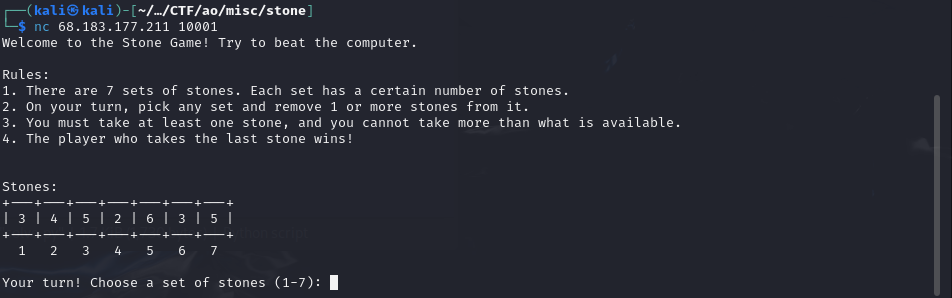
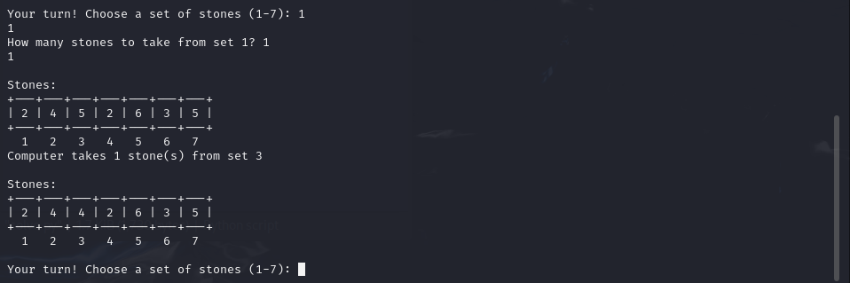

# Stone Game (100 pts)

> Author: **farisv**
>
> Welcome to the Stone Game. Take turns with the computer to pick stones from any set. Remove as many as you want, but the one who takes the last stone wins. Plan your moves carefully and try to outsmart the computer.
>
> `nc 68.183.177.211 10001`

In this challenge, we are given a service where we can play a game against the computer.

<figure><figcaption></figcaption></figure>

<figure><figcaption></figcaption></figure>

This game resembles a strategy game called Nim ([https://en.wikipedia.org/wiki/Nim](https://en.wikipedia.org/wiki/Nim)). Mathematically, we have a winning-guaranteed strategy if the "nim sum" of the stones is not zero and it's our turn. Unfortunately though, here we go first and the inital "nim sum" is zero. That means it's the computer that has a winning strategy. Even if we do all the optimal moves explained in the Wikipedia link above, we'd still lose assuming that the computer also choose the optimal moves every time.

Thankfully, this service has a vulnerability where it actually accepts "0" as the number of stones to take. It means that after we take 0 stone, the computer is now forced to take some stones and thus make the "nim sum" of the stone not zero. After that, we have a winning strategy.

Here's the full code.

```py
from pwn import *
import random

r = remote('68.183.177.211', 10001)

heaps = []
LEN = 7		# number of sets

# helper functions

def update_heaps(arr, len):
	for i in range(len):
		arr[i] = int(r.recv(1))
		r.recv(3)

def calculate_nimsum(arr):
	sum = 0
	for n in arr:
		sum ^= n
	return sum

def pick_set(arr, sum):
	count = 0
	for n in arr:
		res = n ^ sum
		if res < n:
			return count
		count += 1
	return -1

def get_reduce_val(arr, sum, idx):
	val = arr[idx] - (arr[idx] ^ sum)
	return val

# collect sets of stones into an array
r.recvuntil(b'| ')
for _ in range(LEN):
	heaps.append(int(r.recv(1)))
	r.recv(3)
print(heaps)


# check condition, then pick what to do
# 1: if sum is zero, take 0 from the first set (apparently it's possible)
# 2: if sum is not zero, do the optimal steps [https://en.wikipedia.org/wiki/Nim]

while True:

	# picking the next set
	try:
		r.recvuntil(b': ')

	# game is over
	except:
		# print all remaining lines
		try:
			while True:
				print(r.recvline().strip().decode())
		except:
			break

	nimsum = calculate_nimsum(heaps)

	# play zero
	if calculate_nimsum(heaps) == 0:
		print("playing zero...")
		r.sendline(str(1).encode())		# pick the first set
		r.recvuntil(b'? ')
		r.sendline(str(0).encode()) 	# sending 0

	# play optimally
	else:
		print("playing optimally...")
		reduce_set = pick_set(heaps, nimsum)
		reduce_val = get_reduce_val(heaps, nimsum, reduce_set)
		r.sendline(str(reduce_set+1).encode())	# add 1 because array index start at 0
		r.recvuntil(b'? ')
		r.sendline(str(reduce_val).encode())

	# update the heaps
	try:
		r.recvuntil(b'Computer')
		r.recvuntil(b'| ')
		update_heaps(heaps, LEN)
		print("new heaps:", heaps)
	except:
		continue
```

Flag: `CJ{why_I_allowed_zero_:(}`
