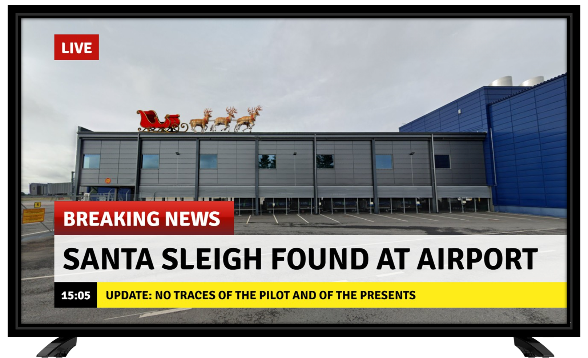

# Day 10 - Breaking News

<figure><figcaption></figcaption></figure>

Question: Where the sleigh was parked, what is the nearest coffee shop?

### Solution

We can do some reverse image search to get the location of where it was taken. Adding "airport finland" to the search term would help Google to give more relevant results.

<figure><figcaption></figcaption></figure>

<figure><figcaption></figcaption></figure>

Many results point to "Oulu Airport". We can use Google Street View to try and confirm it. Indeed it is.

<figure><figcaption></figcaption></figure>

Now, it's just a matter of finding the nearest coffee shop.

<figure><figcaption></figcaption></figure>

Flag: `Vohvelikuningas`
