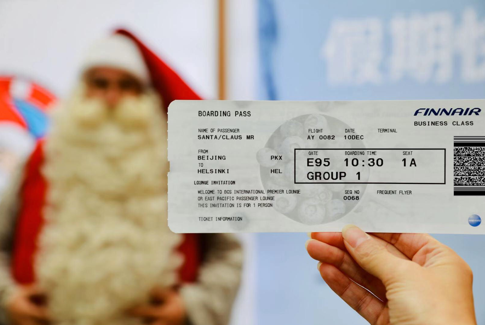

# Day 12 - Lost and Found

<figure><figcaption></figcaption></figure>

Question: The thief is not only pretending to be Santa Claus, but also quoting who?

### Solution

In the boarding pass picture, there is a barcode. We can read that barcode using Google Lens.

<figure><figcaption></figcaption></figure>

It seems that The Thief had left the airport and is now somewhere warmer than Finland. Anyways, The Thief quoted "Hasta la vista, baby!" which was first coined by the Terminator.

<figure><figcaption></figcaption></figure>

Flag: `Terminator`
