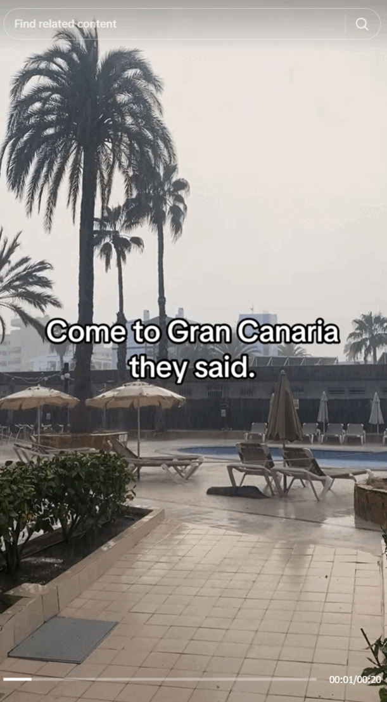

# Day 16 - Status Update

<figure><figcaption></figcaption></figure>

Question: Which hotel is the thief staying at?

### Solution

On the WhatsApp status, we see a screenshot of The Thief's WiFi settings. Interestingly, one SSID of a network is visible in the screenshot: `D1734F086319`.

<figure><figcaption></figcaption></figure>

We can try to geolocate this network using [wigle.net advanced search](https://wigle.net/search). Just type in the SSID and we're good to go.

<figure><figcaption></figcaption></figure>

Putting the coordinates on Google Maps, we see a hotel nearby the pinpoint.

<figure><figcaption></figcaption></figure>

Flag: `Club Cala Blanca`
