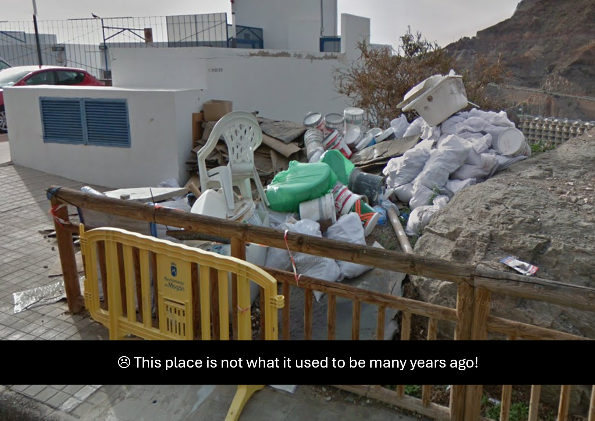

# Day 17 - Waste ...of Time

<figure><figcaption></figcaption></figure>

Question: What is the sentence that was written on the outside of the blue / grey box 16 years ago?

### Solution

This challenge was one of the most confusing to me as it seems that there was not any lead. But here's the logic. This challenge is directly related to the previous challenge. If, in the previous challenge, The Thief took some pictures in the hotel to update his status... then the "waste" photo above, being a status update as well, must also being taken in the same hotel. Therefore, what we can do is to take a look at the Google Street View data of this hotel.

<figure><figcaption></figcaption></figure>

We can see exact match to the "status update" image here.

<figure><figcaption></figcaption></figure>

Now, we can click "see more dates" and select the Street View coverage from 2008. There's indeed a blue/grey box.

<figure><figcaption></figcaption></figure>

Here's what it says.

<figure><figcaption></figcaption></figure>

Flag: `Tu papel es importante`
