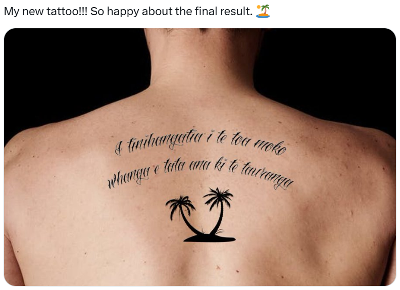

# Day 18 - Lost in Translation

<figure><figcaption></figcaption></figure>

Question: What is the name of the tattoo parlour ?

### Solution

Status update again... Anyways, we can try translating the text using Google Lens, but the cursive font made Google struggle to read the correct word.

<figure><figcaption></figcaption></figure>

Here's the problematic word.

<figure><figcaption></figcaption></figure>

Google read it as "tanvanga" (no meaning), when it should be "_tauranga" (port). In the end, the text "I tinihangatia i te toa moko whanga e tata ana ki te tanvanga_" translates to "_Got scammed at a tattoo shop near the port_".

<figure><figcaption></figcaption></figure>

The "port" must mean the biggest port in Gran Canaria island, as we can kinda predict that The Thief is gonna be moving elsewhere soon. But for now, we can search for the nearest tattoo parlour from that port.

<figure><figcaption></figcaption></figure>

Flag: `Tattoo Santa Catalina`
