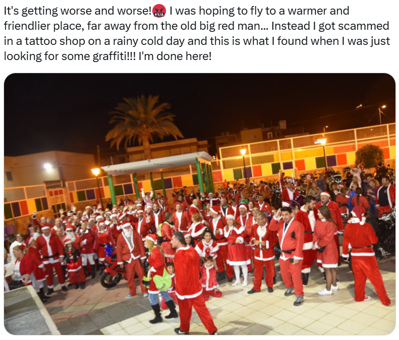

# Day 19 - Santa's Clones

<figure><figcaption></figcaption></figure>

Question: What is written on the graffiti?

### Solution

We have to determine where this image was taken, and then look for the graffiti. Reverse image search is always a good start.

<figure><figcaption></figcaption></figure>

We got an exact match on [this](https://www.canariasenmoto.com/index.php?pagina=moteros\&ver=noticia\&id=21991) website.&#x20;

<figure><figcaption></figcaption></figure>

<figure><figcaption></figcaption></figure>

Basically, the party thingy happening with people wearing Santa's costume happened at the caravan's end destination, El Pajar.

<figure><figcaption></figcaption></figure>

Using Google Street View, we can look for the graffiti. We can confirm that this is the exact place by matching the colorful tiles on the background walls. On the graffiti, "SANTA AGUEDA 2018" is written.

<figure><figcaption></figcaption></figure>

Flag: `SANTA AGUEDA 2018`
