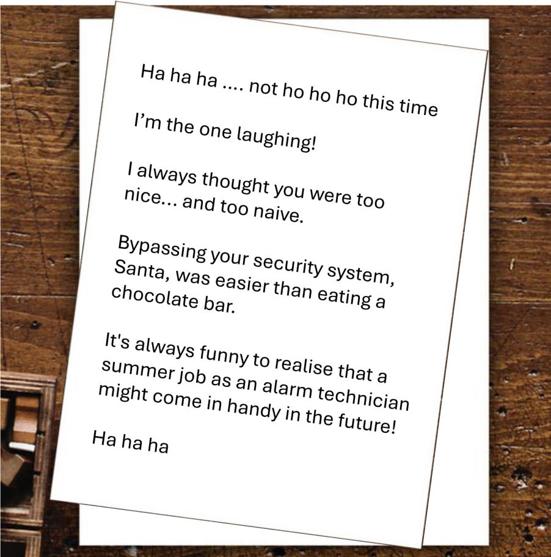

# Day 2 - The Summer Job

<figure><figcaption></figcaption></figure>

Question: What is the name of the company the thief worked for?

#### Solutions

Now, we are starting to look at the letters found from the previous challenge. An important note to keep in mind throughout this CTF is that we are solving these challenges as if we actually live by Santa himself, inside the Santa Claus Office in Finland. Therefore, for the next few challenges we'll have to utilize the indoor street view of the Santa Claus Office we used before. Moreover, we have to assume that this investigation is happening real time, during December of 2024 (this assumption would be useful later).

Anyways, the first page of the letter is asking us to find the writer of the letter's (in this case we'll call The Thief) summer job company.

Looking from Santa's perspective, we read that The Thief once worked in Santa Claus Office as an alarm technician. That means that the alarm is still there. We can find where that alarm is using Google Street View of the office. It turns out that the alarm was just nearby the main entrance.

<figure><figcaption></figcaption></figure>

We can use Google Reverse Image Search to find what company made that alarm. Here, we found an exact match, and the result came from the company's website.

<figure><figcaption></figcaption></figure>

Flag: `Hedengren`
