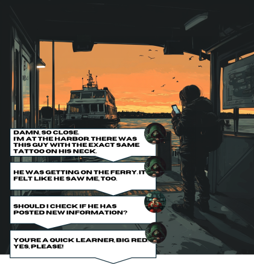

# Day 20 - Losing Tracks

<figure><figcaption></figcaption></figure>

Question: What does the thief want to visit?

### Solution

As Santa mentioned in the image, we should check if The Thief has posted something new. Looking at The Thief's X account, here's what we found.

<figure><figcaption></figcaption></figure>

"Cover my tracks" as if he has something to be covered. Basically, this means that there was a post that he deleted because he realized that someone is following him. To look for "deleted posts", we can use [the Wayback Machine](https://web.archive.org/).&#x20;

<figure><figcaption></figcaption></figure>

Too bad. It seems that it's not archived here. No problem, as there is an alternative to Internet Archive: [archive.is](https://archive.is/). Here's what it found.

<figure><figcaption></figcaption></figure>

Great. We've obtained the deleted post. The Thief wants to visit Teide observatory.

<figure><figcaption></figcaption></figure>

Flag: `Teide Observatory`
