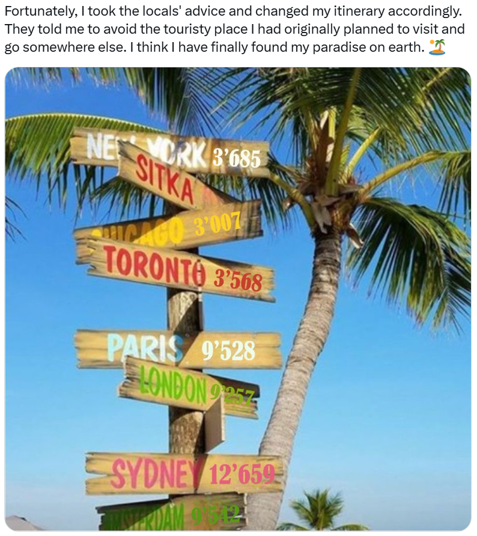

# Day 23 - Distances Matters

<figure><figcaption></figcaption></figure>

Question: What is the thief's paradise on earth?

### Solution

This is an interesting challenge. The Thief posted a "directional sign" which are common in tourist spots.&#x20;

Just from this information, we can actually triangulate where that place is in the world. The way it works is that for example, you put a circle around New York with a radius of 3,685 km, a circle around Paris with a radius of 9,528 km, and finally around Sydney with 12,659 km radius. The three circles are bound to intersect in one place (and one place only). They intersect in the place where the "directional sign" is located.&#x20;

We can calculate using hands, or use [this tool](https://www.mapdevelopers.com/draw-circle-tool.php).

<figure><figcaption></figcaption></figure>

The circles intersected somewhere in Mexico. Zooming in, we see that the intersection is not actually very precise (btw you can visit the map [here](https://www.mapdevelopers.com/draw-circle-tool.php?circles=%5B%5B3685000%2C40.7127281%2C-74.0060152%2C%22%23AAAAAA%22%2C%22%23000000%22%2C0.4%5D%2C%5B9528000%2C48.8534951%2C2.3483915%2C%22%23AAAAAA%22%2C%22%23000000%22%2C0.4%5D%2C%5B12659000%2C-33.8698439%2C151.2082848%2C%22%23AAAAAA%22%2C%22%23000000%22%2C0.4%5D%5D)).&#x20;

<figure><figcaption></figcaption></figure>

Regardless, we roughly got The Thief's "paradise on earth". It's the nearby island of "Isla Ixtapa". You can Google the island to confirm that it is indeed a tourist place.&#x20;

Flag: `Isla Ixtapa`
