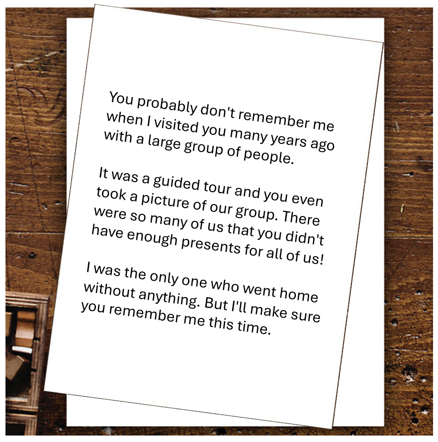

# Day 3 - The Visitors

<figure><figcaption></figcaption></figure>

Question: What is the name of the group?

### Solution

As a context, there are plenty of photos featuring Santa and his visitors hanged throughout Santa Claus Office. We can start looking around the building to find them. First of all, enter using this entrance right here.

<figure><figcaption></figcaption></figure>

Following along, we'll eventually arrive at the stairs that takes us to the second floor. Take it, and we see a bunch of photos.

<figure><figcaption></figcaption></figure>

One picture stands out among the others, as it's the only one featuring so many children, and with the children's group name written as well.

<figure><figcaption></figcaption></figure>

Flag: `SIRKUS FINLANDIA`
