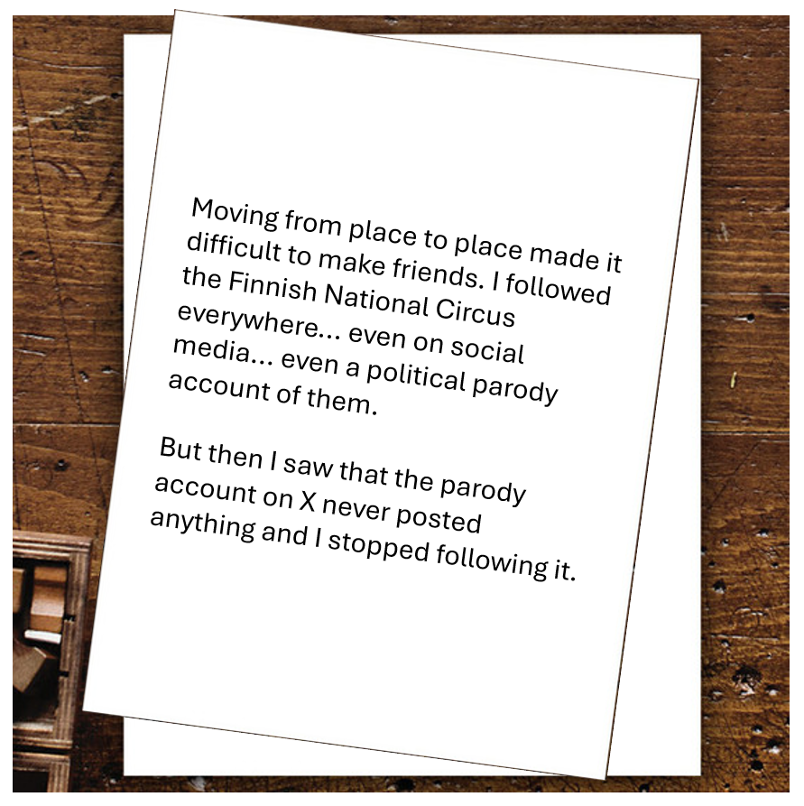

# Day 7 - Revealing Pixels

<figure><figcaption></figcaption></figure>

Question: What is the name of the fourth person on the right in the parody account's profile picture?

### Solution

Based on the letter, we can search for "Sirkus Finlandia" on X/Twitter. We can see that one of them is a real account of the circus, and the other is a political parody account. We can even verify what the letter was saying by confirming that the political parody account have not posted anything.&#x20;

<figure><figcaption></figcaption></figure>

Now onto the question, let's take a look at the parody account's profile picture.

<figure><figcaption></figcaption></figure>

At first, the phrase "the fourth person on the right" doesn't seem right, because there are only three people visible in the image. But let's try to do a reverse image search and find the original image. For the purpose of finding the original version of an image, I think TinEye does the best job.

<figure><figcaption></figcaption></figure>

<figure><figcaption></figcaption></figure>

TinEye succeded in finding the original image. As we can see, there are four people in the photo, which confirms what the question said. Now, we can try to look up who is the person on the right using simple Reverse Image Search.

<figure><figcaption></figcaption></figure>

Flag: `Katri Kulmuni`
