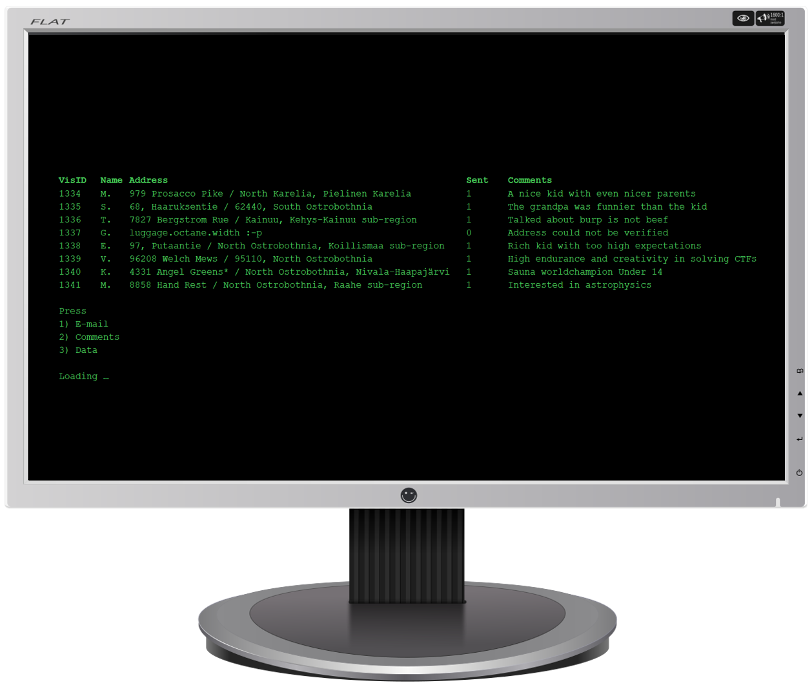

# Day 9 - 404 Not Found

<figure><figcaption></figcaption></figure>

Question: Where did the thief pretend to live?

### Solution

One address stood out amongst the others, and it belongs to someone whose name starts with G (Gabriel?!).

This is a pretty niche thing. But there is a website that assigns every single part of the world using a combination of three words, so that you don't need to use address. It's [https://what3words.com/](https://what3words.com/).

Typing "luggage.octane.width" into the website gave us this. This is Area 51.

<figure><figcaption></figcaption></figure>

Flag: `Area 51`
