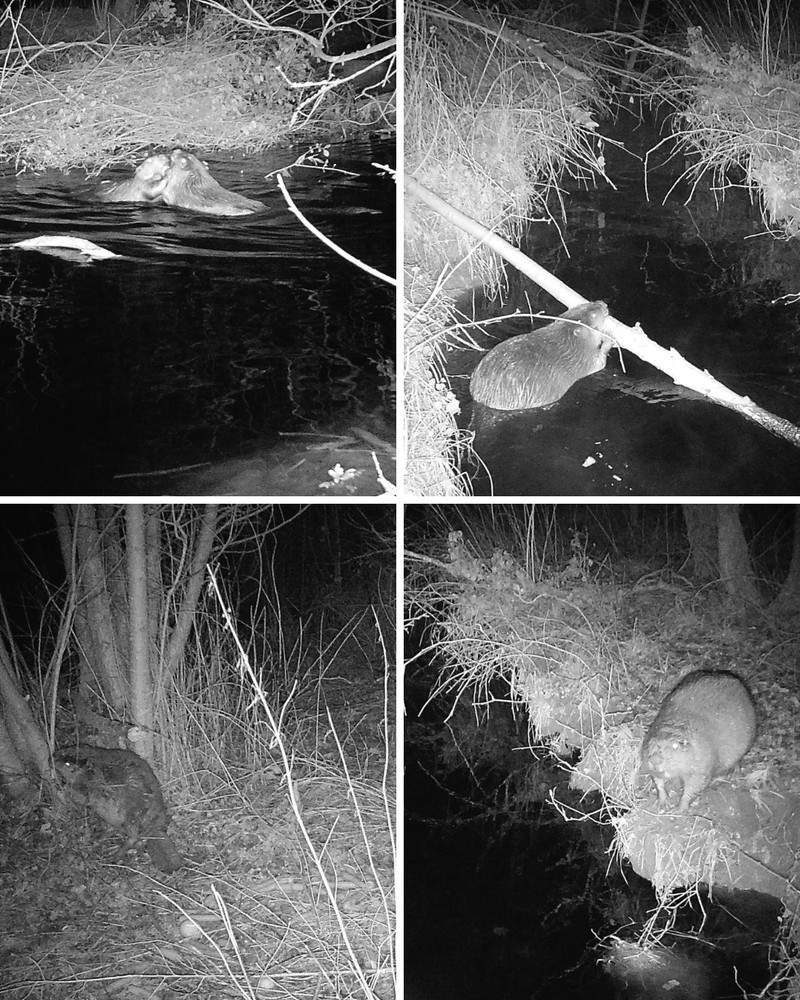

# Busy As A (300 pts)

> Which Bluesky account posted this cute picture for World Wildlife Day? The answer is the account handle.
>
> \*Answer is the unique portion of the Bluesky handle in lowercase, without any punctuation i.e. for @wildlifenews.bsky.social the flag would be wildlifenews.

### Solution

We are given this image.

<figure><figcaption></figcaption></figure>

After doing a reverse image search, we found this [Bluesky hashtag](https://bsky.app/hashtag/notcrowley) which leads us to [this post](https://bsky.app/profile/southdownsnp.bsky.social/post/3ljhbj3edek2g).

<figure><figcaption></figcaption></figure>

The account who posted the photo is `‪@southdownsnp.bsky.social‬`.

<figure><figcaption></figcaption></figure>

Flag: `‪southdownsnp`
