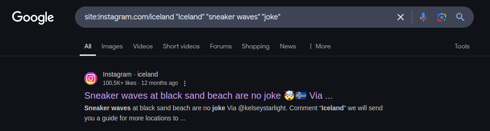

# Getting Started (100 pts)

> Twan Teunissen registered a wild website quite a while ago. What is the domain name? _Answer in lowercase, the format is: domain.com_

This challenge has a followup challenge: [legendary-beasts-200-pts.md](legendary-beasts-200-pts.md "mention")

### Solution

From the description, "registered" likely means that the person in question is the registrar of the website. Usually, one could use `whois domain.com` to get such information. However, we are provided with the registrar name, instead of the domain. Therefore, we have to use a reversal tool such as [https://viewdns.info/reversewhois/](https://viewdns.info/reversewhois/).

<figure><figcaption></figcaption></figure>

Inputting "Twan Teunissen" into the website, we get [rewildingeurope.com](https://rewildingeurope.com/), which matches the "wild website" description.&#x20;

We could further verify this by utilizing a historical whois tool, which would give us a list of current and former registrar of a domain. For this, tools such as [https://whoisfreaks.com/tools/whois/history/lookup](https://whoisfreaks.com/tools/whois/history/lookup) can be used.

Flag: `rewildingeurope.com`
