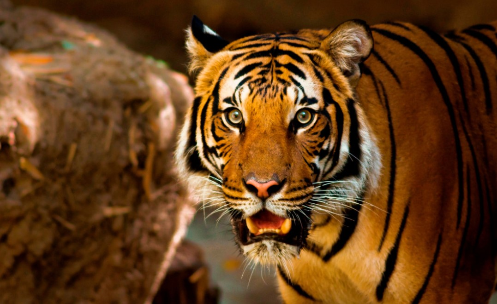
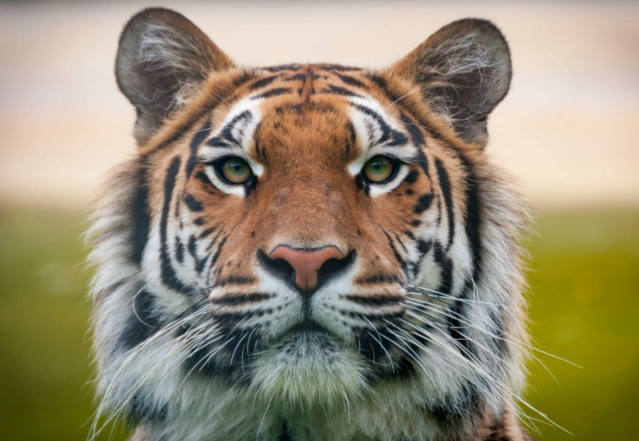
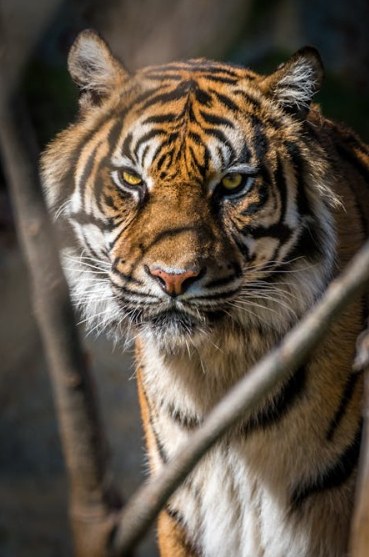
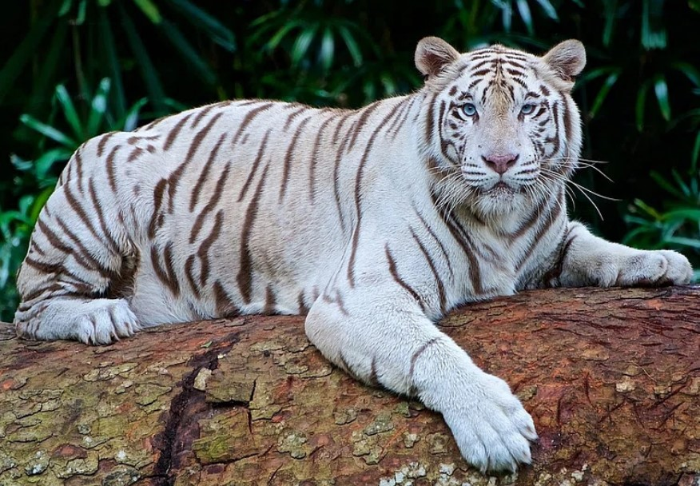

# Kitty Cats (500 pts)

> Check out my collection of kitty cats – aren’t they adorable? Can you find the hidden message? It’s a two word phrase linked to these fearsome furry creatures. _Answer is two words, lowercase i.e. starry night_

### Solution

We are given four images, each named `onetiger.jpg`, `twotiger.jpg`,  `threetiger.jpg`, and `four.jpg`.

| <div><figure><figcaption></figcaption></figure></div>   | <div><figure><figcaption></figcaption></figure></div> |
| --------------------------------------------------------------------------------------------------------------- | ------------------------------------------------------------------------------------------------------------- |
| `onetiger.jpg`                                                                                                  | `twotiger.jpg`                                                                                                |
| <div><figure><figcaption></figcaption></figure></div> | <div><figure><figcaption></figcaption></figure></div>     |
| `threetiger.jpg`                                                                                                | `four.jpg`                                                                                                    |

At first, I thought that the hidden message has something to do with the tiger itself, because each photo shows a different type of tiger, which are, in the naming order of the files:

```
1: panthera tigris jacksoni (malayan)
2: panthera tigris altaica (siberian/amur)
3: panthera tigris sumatrae (sumatran)
4: panthera tigris tigris (bengal)
```

After wrapping my head around this for hours, I was stuck. The only two word phrase that connects the four tigers is `panthera tigris`, yet it's not the answer.

Pondering at the challenge description, "hidden message" can come from the image's content (in this case the tigers) or the image file itself (see [steganography](https://en.wikipedia.org/wiki/Steganography)). To confirm this, take for example, `onetiger.jpg`. Using reverse image search, we can get the [original source](https://www.freepik.com/premium-photo/tiger-tree-trunk_159551351.htm) of the image. When checking their hash, it can be confirmed that the challenges' images has been modified from the original.

<figure><figcaption></figcaption></figure>

The difference is clear when we check both images' metadata using `exiftool`.

<figure><figcaption></figcaption></figure>

At this point, it's clear that the "hidden message" is located in each image's metadata, specifically in this attribute called "XP Comment", which all of the challenge images have.

<figure><figcaption></figcaption></figure>

<figure><figcaption></figcaption></figure>

<figure><figcaption></figcaption></figure>

<figure><figcaption></figcaption></figure>

Combining all of them in order, we get the base64 srtring `ZmVhcmZ1bCBzeW1tZXRyeQ==`, which decodes to `fearful symmetry`.

Flag: `fearful symmetry`
