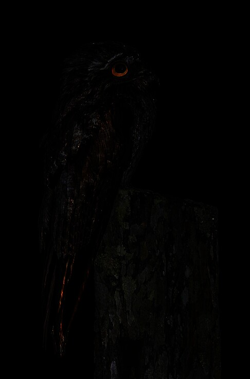
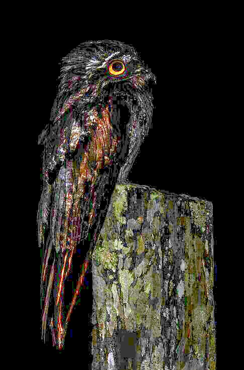

# Nocturnal (300 pts)

> What kind of creature is this fine fellow? _Answer is the type of animal, one word singular, lowerase i.e. sloth_

### Solution

We are given this image.

<figure><figcaption></figcaption></figure>

Too dark? It is. Doing reverse image search using this image won't return anything useful. First of all, we need to do some image manipulation. Here, I increased the brightness, contrast, and the saturation of the image.

<figure><figcaption></figcaption></figure>

Using this image, we found the original image, along with the name of the animal (**potoo**).

<figure><figcaption></figcaption></figure>

Flag: `potoo`
