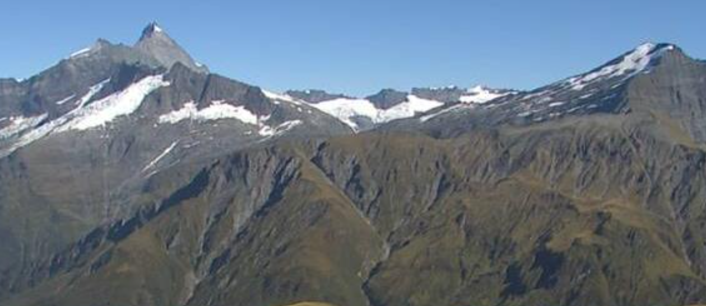

# Peak Weather (400 pts)

> What a view! Check out this beautiful mountain peak captured by a weather station webcam. Can you find the name of the chalet where this weather station is situated? _Answer is the two word name of the chalet, lowercase i.e. mont blanc_

### Solution

We are given this image.

<figure><figcaption></figcaption></figure>

At first, I tried to do reverse image search on the image and look for similar mountain-shapes. I came across this [page](https://www.southernalpsphotography.com/Tramping/Aspiring-Region/Dragonfly-Peak) which indicates that the mountain name is **Mount Aspiring**, so the location of the camera should be close to that.

<figure><figcaption></figcaption></figure>

<figure><figcaption></figcaption></figure>

From there, I used Google Earth 3D View to match the angle of the photo. The coordinate is [-44.38183253,168.82842218](https://earth.google.com/web/@-44.38183253,168.82842218,1729.49920714a,3880.55017996d,35y,-79.59036085h,87.82925045t,0r/data=CgRCAggBQgIIAEoNCP___________wEQAA).

<figure><figcaption></figcaption></figure>

Then, I tried searching for a "chalet" near that coordinate on OpenStreetMap. Specifically, I'm using the tool [OverpassTurbo](https://overpass-turbo.eu/) with the code below. Exactly one chalet was found.

```sql
[out:json][timeout:25];

// Gather results
(
  node["tourism"="chalet"](around:10000, -44.38183253, 168.82842218);
  way["tourism"="chalet"](around:10000, -44.38183253, 168.82842218);
  relation["tourism"="chalet"](around:10000, -44.38183253, 168.82842218);
);

// Print results
out body;
>;
out skel qt;
```

<figure><figcaption></figcaption></figure>

To verify if this is the correct answer, I searched for `Whare Kea Chalet camera` and found [this](https://www.wharekealodge.com/mountain-chalet/west-towards-mt-aspiring/) website showing a webcam view that's an exact match with the given image.

<figure><figcaption></figcaption></figure>

<figure><figcaption></figcaption></figure>

Flag: `whare kea`
