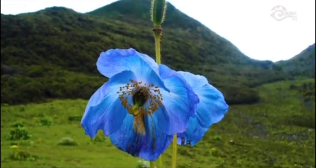

# Proper Poppy (100 pts)

> In which country was this picture of a flower taken? _Answer is one word, lowercase i.e. estonia_

This challenge has a followup challenge: [proper-poppy-ii-200-pts.md](proper-poppy-ii-200-pts.md "mention")

### Solution

We are provided with an image of a flower.

<figure><figcaption></figcaption></figure>

Doing a simple reverse image search, we find [this](https://biodiversity.bt/group/Royal_Manas_National_Park/observation/show/7352) website, which tells us that the photo was taken in **Bhutan**.

<figure><figcaption></figcaption></figure>

Flag: `bhutan`
