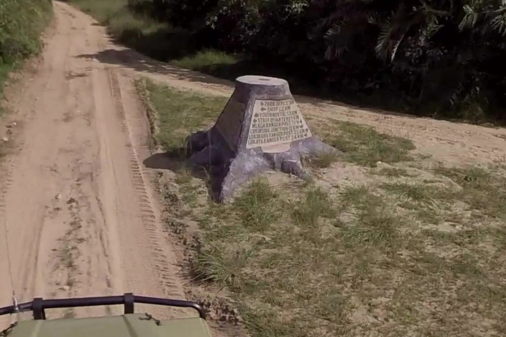

# Safari Time (400 pts)

> We’re on an African island, but which one?\
> &#xNAN;_&#x41;nswer is the two word name of the island, lowercase i.e. heart island_

This challenge has a followup challenge: [safari-time-ii-200-pts.md](safari-time-ii-200-pts.md "mention")

### Solution

We are given this image.

<figure><figcaption></figcaption></figure>

Doing reverse image search on the image didn't return anything meaningful. And so, I tried reading the text on the signpost. The bottom row says "Lukaya Ranger Post", which might be a unique place name. I searched it on Google Maps and got this.

<figure><figcaption></figcaption></figure>

Lukaya Ranger Post is located inside Rubondo National Park, Rubondo Island, Tanzania. [This](https://www.google.com/maps/place/Rubondo+National+Park/@-2.4105904,31.8797837,3a,75y/data=!3m8!1e2!3m6!1sAF1QipM9OIAcfFCwM20vLtOBOhLJHoawgdFkiKJ8OJDx!2e10!3e12!6shttps:%2F%2Flh3.googleusercontent.com%2Fp%2FAF1QipM9OIAcfFCwM20vLtOBOhLJHoawgdFkiKJ8OJDx%3Dw203-h114-k-no!7i4128!8i2322!4m7!3m6!1s0x19cf93eab1e7f077:0x143b7f09cbafce70!8m2!3d-2.4105904!4d31.8797837!10e5!16s%2Fg%2F11gtgbk7w3!5m1!1e2?entry=ttu\&g_ep=EgoyMDI1MDQwOC4wIKXMDSoASAFQAw%3D%3D) photo validates that "Rubondo Island" is indeed the correct location.

<figure><figcaption></figcaption></figure>

Flag: `rubondo island`
