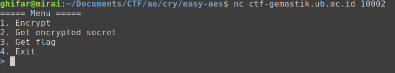
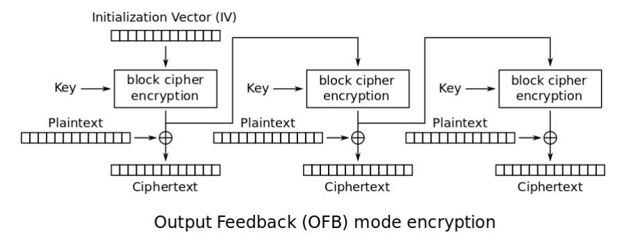
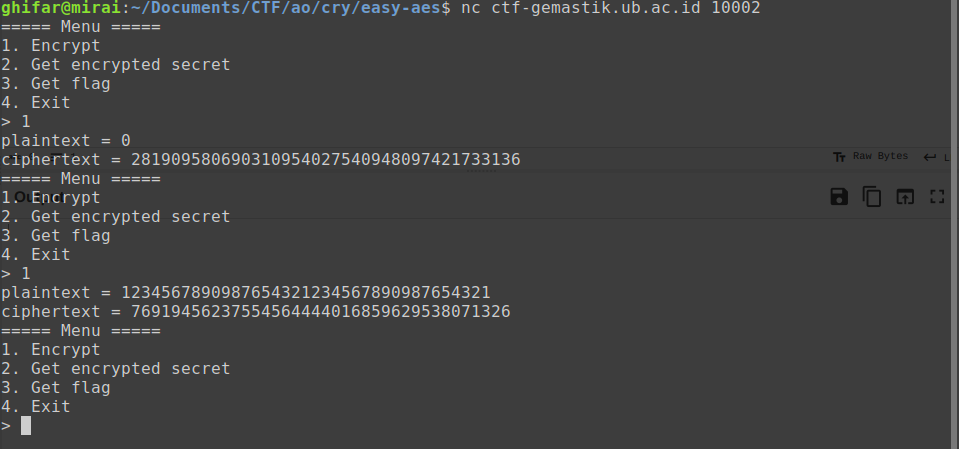
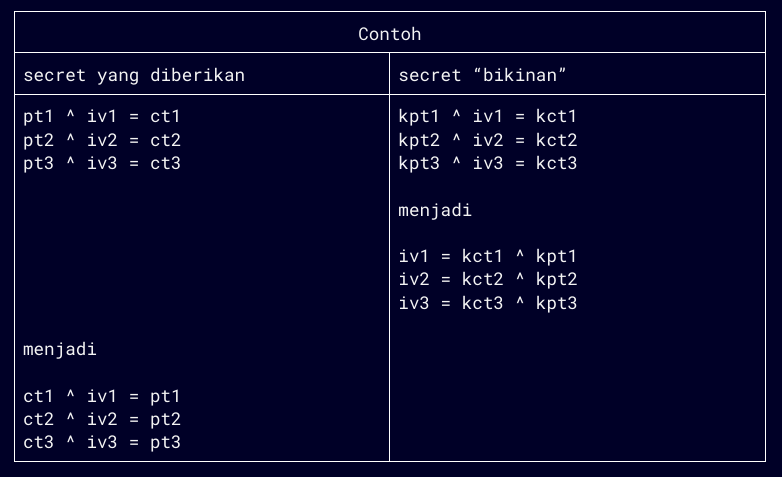
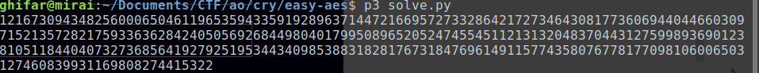
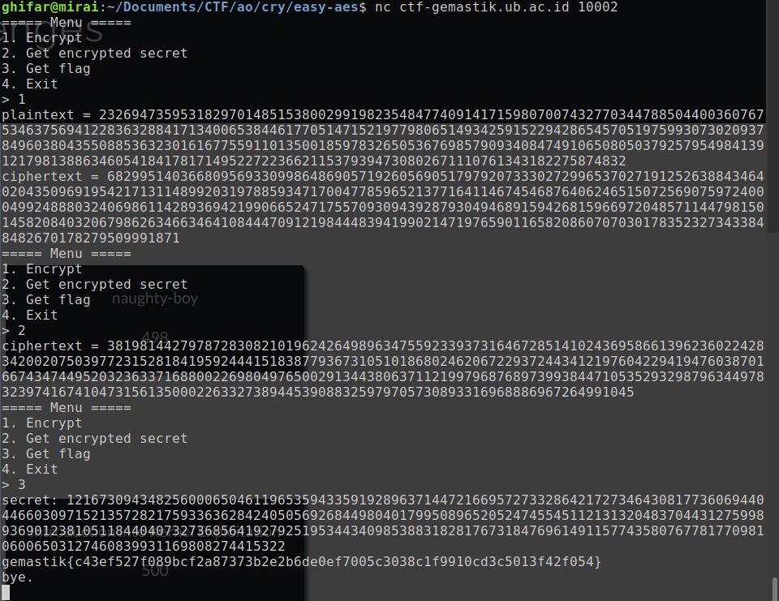

# easy AES (50 pts)

### Deskripsi
> Attack on AES OFB
>
> Author: prajnapras19
>
> nc ctf-gemastik.ub.ac.id 10002

Kita diberikan sebuah service dan source code dari service tersebut.

##### chall.py

```py
from Crypto.Cipher import AES
from Crypto.Util.Padding import pad
from Crypto.Util.number import bytes_to_long, long_to_bytes
import os

key = os.urandom(AES.key_size[0])
iv = os.urandom(AES.block_size)
secret = bytes_to_long(os.urandom(128))

def encrypt(pt):
    bytes_pt = long_to_bytes(pt)
    cipher = AES.new(key, AES.MODE_OFB, iv)
    padded_pt = pad(bytes_pt, AES.block_size)
    return bytes_to_long(cipher.encrypt(padded_pt))

def menu():
    print('===== Menu =====')
    print('1. Encrypt')
    print('2. Get encrypted secret')
    print('3. Get flag')
    print('4. Exit')
    choice = int(input('> '))
    return choice

def get_flag():
    res = int(input('secret: '))
    if secret == res:
        os.system('cat flag.txt')
        print()

while True:
    try:
        choice = menu()
        if choice == 1:
            pt = int(input('plaintext = '))
            ciphertext = encrypt(pt)
            print(f'{ciphertext = }')
        if choice == 2:
            ciphertext = encrypt(secret)
            print(f'{ciphertext = }')
        if choice == 3:
            get_flag()
            break
        if choice == 4:
            break
    except:
        print('something error happened.')
        break

print('bye.')
```

Berikut tampilannya apabila dijalankan.



Pada soal ini, terdapat sebuah implementasi `AES` dengan mode `OFB` yang kelihatannya normal-normal saja. Lalu di mana vuln-nya? Setelah membaca berbagai sumber untuk memahami mode operasi OFB, saya jadi memahami bahwa OFB ini intinya adalah iv yang di-enkripsi berkali-kali (sesuai jumlah block), lalu hasil enkripsi tersebut di-xor-kan dengan plaintext pada block masing-masing. Jika dipikir-pikir, OFB ini bekerja seperti OTP (One Time Password) di mana OTP-nya adalah nilai dari IV. 



Bicara soal OTP, satu hal yang harus diperhatikan adalah password yang digunakan pada OTP hanya boleh digunakan sekali. Masalahnya, pada soal ini, kita malah diperbolehkan meng-enkripsi plaintext apapun berkali-kali, tentunya dengan iv yang sama :). Di sinilah letak *vuln*-nya.



Nah untuk meng-exploitnya, mari kita merujuk kembali pada cara kerja OFB. Kita bisa saja meng-input pesan “bikinan” yang nilainya kita ketahui untuk di-enkripsi pada service. Dengan memiliki sepasang plaintext dan ciphertext yang diketahui, kita bisa menemukan nilai “iv yang dienkripsi” dengan beberapa operasi xor.

Supaya lebih jelas, berikut ini adalah contoh. Katakanlah ada pesan sepanjang 3 block yang dienkripsi dengan OFB. Di sini, plaintext ditulis sebagai `pt`, `iv` berarti “iv hasil enkripsi”, `kpt` adalah known plaintext (nilai “bikinan” kita), dan `kct` adalah known ciphertext.



Maka dari itu, untuk mendapatkan nilai `secret`, ini adalah hal-hal yang perlu kita lakukan:
- membuat nilai `kpt`
- membagi `kpt` ke dalam block”

- meng-enkripsi `kpt` → mendapatkan nilai `kct`
- membagi `kct` ke dalam block”

- meng-xor masing-masing block (`kpt_i` ^ `kct_i`) → mendapatkan `iv`

- mengambil nilai `ct` (dari service)
- membagi `ct` ke dalam block”

- meng-xor masing-masing block (`ct` ^ `iv`) → mendapatkan `pt`
- ubah `pt` dari format per block, menjadi satu kesatuan utuh.
- submit

Dan berikut ini adalah kode solver yang mengimplementasikan hal-hal di atas.

##### solve.py
```py
from Crypto.Util.Padding import pad, unpad
from Crypto.Util.number import *


# get kpt blocks
# block akhir adalah padding
kpt = b'aaaaaaaaaaaaaaaaaaaaaaaaaaaaaaaaaaaaaaaaaaaaaaaaaaaaaaaaaaaaaaaaaaaaaaaaaaaaaaaaaaaaaaaaaaaaaaaaaaaaaaaaaaaaaaaaaaaaaaaaaaaaaaaa\x10\x10\x10\x10\x10\x10\x10\x10\x10\x10\x10\x10\x10\x10\x10\x10'
kpt_blocks = [kpt[i : i + 16] for i in range(0, len(kpt), 16)]
kpt_long = [bytes_to_long(block) for block in kpt_blocks]

# get kct blocks
# nilai kct didapat dari service
kct = long_to_bytes(6829951403668095693309986486905719260569051797920733302729965370271912526388434640204350969195421713114899203197885934717004778596521377164114674546876406246515072569075972400049924888032406986114289369421990665247175570930943928793049468915942681596697204857114479815014582084032067986263466346410844470912198444839419902147197659011658208607070301783523273433848482670178279509991871)
kct_blocks = [kct[i : i + 16] for i in range(0, len(kct), 16)]
kct_long = [bytes_to_long(block) for block in kct_blocks]

# get iv blocks
iv = []
for pt, ct in zip(kpt_long, kct_long):
	iv.append(pt ^ ct)


# get ct blocks
# nilai ct didapat dari service
ct = long_to_bytes(38198144279787283082101962426498963475592339373164672851410243695866139623602242834200207503977231528184195924441518387793673105101868024620672293724434121976042294194760387016674347449520323633716880022698049765002913443806371121997968768973993844710535293298796344978323974167410473156135000226332738944539088325979705730893316968886967264991045)
ct_blocks = [ct[i : i + 16] for i in range(0, len(ct), 16)]
ct_long = [bytes_to_long(block) for block in ct_blocks]

# get pt blocks (the original secret)
result = []
for m, ct in zip(ct_long, iv):
	result.append(m ^ ct)


# menyatukan blocks
res_blocks = [long_to_bytes(block) for block in result]
secret = b"".join(res_blocks)
secret = unpad(secret,16)		# jangan lupa unpad
print(bytes_to_long(secret))
```

Dari sini, hasil secret-nya tinggal kita submit ke server. Flag pun didapatkan.




**Referensi**
https://en.wikipedia.org/wiki/Block_cipher_mode_of_operation 
https://ctftime.org/writeup/22856#ofbuscated

Flag: `gemastik{c43ef527f089bcf2a87373b2e2b6de0ef7005c3038c1f9910cd3c5013f42f054}`