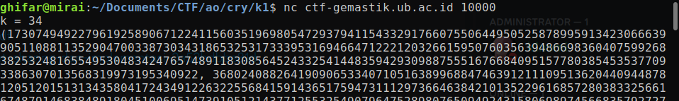
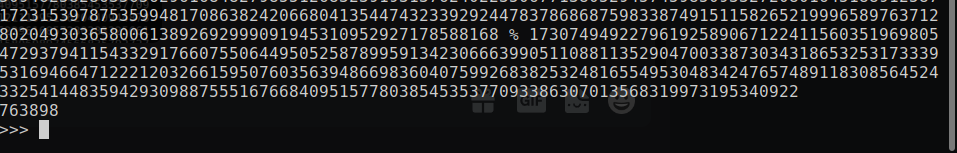
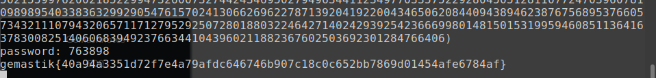

# k-1 (416 pts)

### Deskripsi
> Shamir said we need k shares to recover the secret.
>
> Author: prajnapras19
>
> nc ctf-gemastik.ub.ac.id 10000

Seperti biasa, kita diberikan sebuah service dan source code dari service tersebut.

##### chall.py

```py
import random
import os

bits = 1024
k = random.randint(20, 35)
password = random.getrandbits(bits) % 1000000

def get_shares():
    coeffs = [password] + [random.getrandbits(bits) for _ in range(k - 1)]
    x_list = set()
    while len(x_list) < k - 1:
        x_list.add(random.getrandbits(bits))
    
    shares = []
    for x in x_list:
        y = sum(map(lambda i : coeffs[i] * pow(x, i), range(len(coeffs))))
        shares.append((x, y))
    
    print(f'{k = }')
    for share in shares:
        print(share)

def get_flag():
    res = int(input('password: '))
    if password == res:
        os.system('cat flag.txt')
        print()

try:
    get_shares()
    get_flag()        
except:
    print('something error happened.')
```

Jika dijalankan, hasil output-nya kira-kira seperti berikut. Kita diberikan nilai `k` (jumlah share yang dibutuhkan untuk me-recover `secret`) serta pasangan” (x,y) dari `share` untuk `secret` yang hanya diberikan sebanyak `k-1`. Btw pada soal ini, `secret` yang ingin dicari adalah `password`.



Pertama-tama, yang saya lakukan adalah membaca berbagai write-up terkait `Shamir Secret Sharing Scheme`, karena kelihatannya itu adalah materi dari soal ini. Namun karena mulai merasa kesulitan (skill issue :v), saya mulai memikirkan apakah penyelesaian soal ini dilakukan secara non konvensional. Terlebih, saya merasa ada yang aneh dengan soal ini. Biasanya (di ctf lain), nilai `x` pada `share`” yang diberikan angkanya kecil (1, 2, 3, ...). Tapi di soal ini baik nilai `x` maupun koefisien polinomial-nya sangat sangat besar.

Fokus saya tertuju pada bagian kode berikut.

```py
bits = 1024
k = random.randint(20, 35)
password = random.getrandbits(bits) % 1000000

def get_shares():
    coeffs = [password] + [random.getrandbits(bits) for _ in range(k - 1)]
```

Jumlah digit koefisien pertama (`password`) saja tidak sampai 7, tapi koefisien lainnya punya nilai sebesar 1024-bit. Ini berarti ada ketimpangan yang sangat jauh. Apabila kita pikirkan cara kerja polinomial...

```
misal ada polinomial yang derajatnya 5

y = ax^5 + bx^4 + cx^3 + dx^2 + ex + f

kalau disederhanakan, dan x bukan salah satu faktor dari f, maka:

y = x(ax^4 + bx^3 + cx^2 + dx + e) + f

dengan begini, maka y mod x = f
```

Kalau saja nilai dari `password` lebih besar dibanding nilai” `x` yang masuk, hal ini (menggunakan modulo) tidak akan bekerja begitu saja, karena kali ini bisa jadi nilai `x` tersebut merupakan salah satu faktor dari `password`.

Pada kasus soal ini, nilai `f` di atas (nilai koefisien paling pertama/konstanta pada polinomial), adalah nilai `password`. Oleh karena itu, untuk mendapatkan `password`, kita ambil saja salah satu `share` (nilai x dan y), lalu lakukan `y mod x`. Password pun bisa kita submit ke server, dan flag didapatkan.




**Referensi**
https://en.wikipedia.org/wiki/Shamir%27s_secret_sharing
https://medium.com/mii-cybersec/pengenalan-shamir-secret-sharing-dan-implementasi-2a52bdbbe81d

Flag: `gemastik{40a94a3351d72f7e4a79afdc646746b907c18c0c652bb7869d01454afe6784af}`