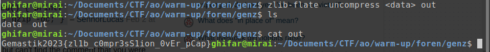

# Gen Z

Kita diberikan file `data`. Apabila kita cek menggunakan command `file data` (atau cek headernya secara manual menggunakan `bless` dan list [Wikipedia](https://en.wikipedia.org/wiki/List_of_file_signatures) ini), kita akan menemukan bahwa file tersebut adalah file `zlib`. Jadi inti dari soal ini adalah, bagaimana cara kita men-decompress file tersebut?

Setelah membaca dari sini: https://unix.stackexchange.com/questions/22834/how-to-uncompress-zlib-data-in-unix, saya jadi mengetahui bahwa command-nya adalah `zlib-flate -uncompress < IN_FILE > OUT_FILE`

Flag: `Gemastik2023{zl1b_c0mpr3sS1ion_0vEr_pCap}`