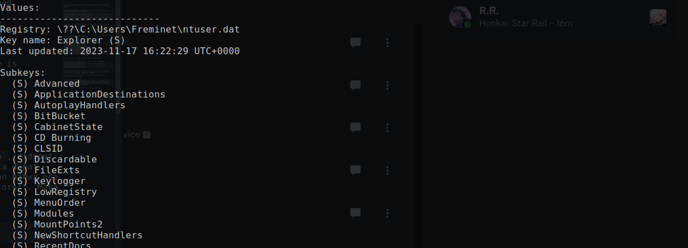
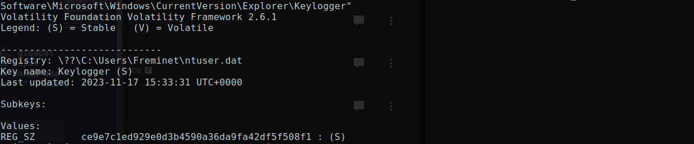
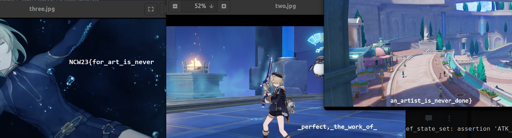

# Freminhelp (Solved after event)

### Deskripsi
> My friend, Freminet, now need your assistance. He once left his lappy alone
in a public area. Several months later, he discovered that a keylogger had
been installed. Unfortunately, during the period when the keylogger was
active, he typed the names of some crucial and confidential files. While
Freminet successfully analyzed the situation and confirmed that the
keylogger did not send any data elsewhere, he was able to delete the
keylogger. He says that the keylogger created a custom key under
Software\Microsoft\Windows\CurrentVersion\Explorer registry. However, he is
now unable to locate the recorded keystrokes by the keylogger.
>
> The flag is divided into 3 parts
>
> https://1drv.ms/u/s!AobVW-isux9NgRg7wc3TRLk9K792?e=JqJfRe
>
> Author: cipichop

Pada chall ini kita diberikan sebuah memory dump. Menggunakan `imageinfo`, didapat bahwa profile memori tersebut adalah `Win7SP1x86_23418`. Berikutnya, kita dapat mulai menganalisis dump memory ini. Berdasarkan deskripsi soal, dikatakan bahwa ada custom key pada registry "Software\Microsoft\Windows\CurrentVersion\Explorer". Maka dari itu langsung saja kita cek menggunakan plugin `printkey`.

```
$ vol.py -f freminhelp.mem --profile=Win7SP1x86_23418 printkey -K "Software\Microsoft\Windows\CurrentVersion\Explorer"
```



Di sini, terdapat key yang sus, yakni `Keylogger`. Untuk melihat value dari subkey tersebut, kita bisa menambahkan namanya pada path.

```
$ vol.py -f freminhelp.mem --profile=Win7SP1x86_23418 printkey -K "Software\Microsoft\Windows\CurrentVersion\Explorer\Keylogger"
```



Awalnya saya bingung value ini harus diapakan, tapi berdasarkan deskripsi, string ini mungkin mengacu pada nama sebuah file. Oleh karena itu, kita bisa melakukan `filescan`.

```
$ vol.py -f freminhelp.mem --profile=Win7SP1x86_23418 filescan | grep -Fi "ce9e7c1ed929e0d3b4590a36da9fa42df5f508f1"

Volatility Foundation Volatility Framework 2.6.1
0x000000003eaab800      8      0 R--rw- \Device\HarddiskVolume1\PerfLogs\Admin\ce9e7c1ed929e0d3b4590a36da9fa42df5f508f1\23da5a4d5d.txt
0x000000003eb81c80      8      0 R--rw- \Device\HarddiskVolume1\PerfLogs\Admin\ce9e7c1ed929e0d3b4590a36da9fa42df5f508f1\fc1f24fe27.txt
0x000000003fc6ab28      8      0 R--rw- \Device\HarddiskVolume1\PerfLogs\Admin\ce9e7c1ed929e0d3b4590a36da9fa42df5f508f1\1f22cfa57c.txt
```

Nah, di sini kita mendapatkan 3 text file. Cukup mencurigakan karena menurut deskripsi, flagnya dibagi menjadi 3 bagian. Bagaimanapun, kita bisa meng-extract ketiga file ini menggunakan `dumpfiles`.

```
$ vol.py -f freminhelp.mem --profile=Win7SP1x86_23418 dumpfiles -Q 0x000000003eb81c80 -D . --unsafe
...
```

Jika kita mencoba melihat isi dari ketiga text file tersebut, kita akan melihat apa yang tampak seperti hasil dari sebuah key logger.

```
$ mv file.None.0x8425c218.23da5a4d5d.txt.dat one.txt
$ cat one.txt
20a86f5ecb6b850cacc73c280d579c60 64a7e258 2
20a86f5ecb6b850cacc73c280d579c60 64a7e259 5
20a86f5ecb6b850cacc73c280d579c60 64a7e259 5
20a86f5ecb6b850cacc73c280d579c60 64a7e25a 3
20a86f5ecb6b850cacc73c280d579c60 64a7e25c c
20a86f5ecb6b850cacc73c280d579c60 64a7e25c 2
20a86f5ecb6b850cacc73c280d579c60 64a7e25c b
20a86f5ecb6b850cacc73c280d579c60 64a7e25e 1
20a86f5ecb6b850cacc73c280d579c60 64a7e25f 7
20a86f5ecb6b850cacc73c280d579c60 64a7e25f 8
20a86f5ecb6b850cacc73c280d579c60 64a7e260 2
...
```

Saya merapikan hasilnya dengan sedikit terminal-fu sebagai berikut.

```
$ cat one.txt | tr -d '\000'| cut -d ' ' -f 3 | tr -d '\n' | xargs echo
2553c2b1782faabba3a3d1a8bfd3a2137e2015cd
$ cat two.txt | tr -d '\000'| cut -d ' ' -f 3 | tr -d '\n' | xargs echo
54c59856cc065b7b07101b36d01988eac07e89fd
$ cat three.txt | tr -d '\000'| cut -d ' ' -f 3 | tr -d '\n' | xargs echo
e92629adecd08ecc2e0b2ae053cce7eee20b9f63
```

Berikutnya, karena pada deskripsi ada hint "typed the names of some crucial and confidential files" maka dapat dikatakan bahwa ketiga string ini merujuk pada nama file. Lagi-lagi, kita gunakan `filescan` dan `dumpfiles`.

Setelah meng-extract file, kita cek apa hasilnya. Rupanya, ketiga file yag didapatkan merupakan file `.jpg`.

```
$ file file.None.0x8543a380.dat 
file.None.0x8543a380.dat: JPEG image data, JFIF standard 1.01, resolution (DPI), density 96x96, segment length 16, Exif Standard: [TIFF image data, big-endian, direntries=1, orientation=upper-left], comment: "Compressed by jpeg-recompress", baseline, precision 8, 1920x927, components 3
```

Setelah itu kita buka saja ketiganya, dan... flag pun didapatkan :)



Flag: `NCW23{for_art_is_never_perfect,_the_work_of_an_artist_is_never_done}`