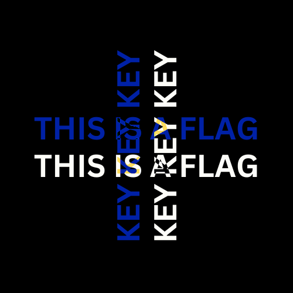
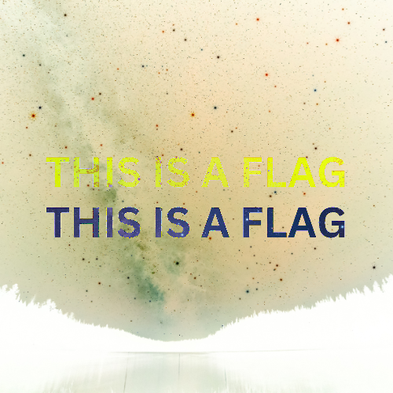
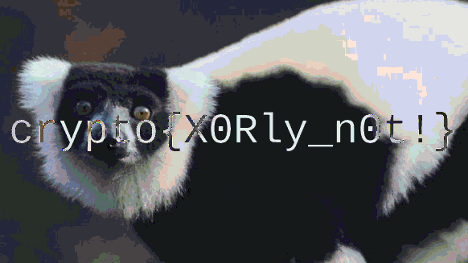

# XOR

### XOR Starter

Make a script as told.

```py
string = "label"

enc = "".join([chr(ord(c)^13) for c in string])
print(enc)
```

Flag: `crypto{aloha}`

### XOR Properties

Here are XOR properties.

```
Commutative: A ⊕ B = B ⊕ A
Associative: A ⊕ (B ⊕ C) = (A ⊕ B) ⊕ C
Identity: A ⊕ 0 = A
Self-Inverse: A ⊕ A = 0
```

Let's try to calculate the flag based on what we have, while considering the XOR properties.

```
k1 = a6c8b6733c9b22de7bc0253266a3867df55acde8635e19c73313
k2 ^ k1 = 37dcb292030faa90d07eec17e3b1c6d8daf94c35d4c9191a5e1e
k2 ^ k3 = c1545756687e7573db23aa1c3452a098b71a7fbf0fddddde5fc1
flag ^ k1 ^ k3 ^ k2 = 04ee9855208a2cd59091d04767ae47963170d1660df7f56f5faf

(flag ^ k1 ^ k3 ^ k2) ^ (k2 ^ k3) = flag ^ k1
(flag ^ k1) ^ k1 = flag
```

And then, let's implement it in Python.

```py
from Crypto.Util.number import *

k1 = int("a6c8b6733c9b22de7bc0253266a3867df55acde8635e19c73313", 16)
k1k2 = int("37dcb292030faa90d07eec17e3b1c6d8daf94c35d4c9191a5e1e", 16)
k2k3 = int("c1545756687e7573db23aa1c3452a098b71a7fbf0fddddde5fc1", 16)
flag_k1k2k3 = int("04ee9855208a2cd59091d04767ae47963170d1660df7f56f5faf", 16)

flagk1 = flag_k1k2k3 ^ k2k3
flag = flagk1 ^ k1

print(long_to_bytes(flag))
```

Flag: `crypto{x0r_i5_ass0c1at1v3}`

### Favourite byte

Since every byte of the flag is encoded with the same one byte, we can try every possible byte to be the key (there are 256 possible combinations) and stop when we get a result that looks like the flag. In this case, it's a result with the string "crypto" in it.

```py
enc = bytes.fromhex("73626960647f6b206821204f21254f7d694f7624662065622127234f726927756d")

# brute force bytes from \x00 until \xff
for b in range(256):
	res = b""
	for c in enc:
		res += (c ^ b).to_bytes(1, "big")

	if b"crypto" in res:
		print(res)
		break
```

Flag: `crypto{0x10_15_my_f4v0ur173_by7e}`

### You either know, XOR you don't

Now, the key is more than just one byte. Bruteforcing the key would likely be infeasible. But, remember how every flag has "crypto{" in the beginning? We can use that to our advantage. If we xor the first 7 bytes of `enc` with `b"crypto"`, we'll get some parts of the key.

```py
# Assume leading 7 chars are "crypto{"
lead = b"crypto{"
key = b""
for i in range(7):
	key += (lead[i] ^ enc[i]).to_bytes(1, byteorder="big")
print(key)

# Result: "myXORke"
```

From the result, we can assume that the key would most likely be "myXORkey". To test this, let's try decrypting with said key. Since the key length is 8 bytes, and the length of `enc` is not a multiple of 8, we need to add padding. That is, by adding some null bytes at the end of `enc` until the length is a multiple of eight.

```py
# Update the key
key = b"myXORkey"

# Add padding to enc to match key length
new_enc = enc + b"\x00"*(len(key) - (len(enc)%len(key)))

# Separate new_enc into chunks of key-size, then xor each chunk with the key
result = b""
for i in range(0, len(new_enc), len(key)):
	for j in range(len(key)):
		result += (new_enc[i+j] ^ key[j]).to_bytes(1, byteorder="big")

# Remove the trailing characters from the previous padding
result = result[:-(len(key)-(len(enc)%len(key)))]
print(result)
```

And we finally got the flag!

Flag `crypto{1f_y0u_Kn0w_En0uGH_y0u_Kn0w_1t_4ll}`

### Lemur XOR

We are given two images that seemingly contain only random pixels. The description tells us that both images (`flag.png` and `lemur.png`) have been XORed with the same secret key (which is probably another image with random pixels).&#x20;

Now get this. Having `image1 ^ key` and `image2 ^ key` will never give you `key`. But we can still XOR both value to get `image1 ^ image2`. You might think that this would give us another random pixel image, but you'd be wrong. When we did the XOR calculation, we discard any element of `key` from the image, as if `key` never made any contact with both of our images. Therefore, the result would give us something that looks like the combination of `image1` and `image2`. I hope the images below would make it clear for you.

<table><thead><tr><th width="205">image1</th><th>image2</th><th>image1 ^ image2</th></tr></thead><tbody><tr><td></td><td></td><td></td></tr><tr><td></td><td></td><td></td></tr><tr><td></td><td></td><td></td></tr></tbody></table>

Now, to the actual challenge. We basically need to XOR each pixel in `flag.png` with each pixel in `lemur.png`. To read pixels in an image file, we can use Python's Image Library (PIL) as written in the code below.

```python
from PIL import Image

img1 = Image.open("lemur.png")
img2 = Image.open("flag.png")
pix1 = img1.load()
pix2 = img2.load()

width, height = img1.size	# both image have same dimensions

img3 = Image.new("RGB", (width, height))
pix3 = img3.load()

for y in range(height):
	for x in range(width):
		for i in range(3):
			r = pix1[x,y][0] ^ pix2[x,y][0]
			g = pix1[x,y][1] ^ pix2[x,y][1]
			b = pix1[x,y][2] ^ pix2[x,y][2]
			pix3[x,y] = (r, g, b)

img3.save("result.png")
print("Done!")
```

At last, we got the resulting image and thus the flag.

<figure><figcaption></figcaption></figure>

Flag: `crypto{X0Rly_n0t!}`
