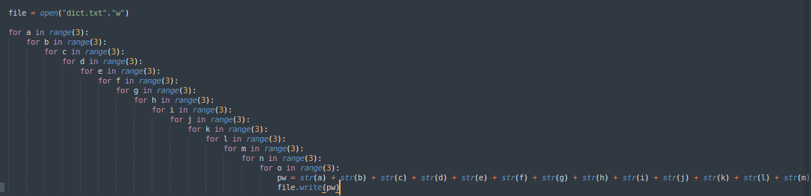
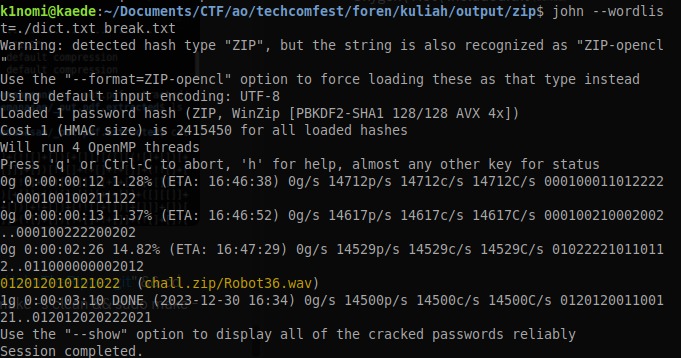

# Kuli-ah forensik (275 pts)

### Deskripsi
> Author: fire
>
> I just created secret message in image file but i want to make it secure so i transform it to audio file. But i think it's not secure enough so i archive it with password. I encrypt it with very strong password. I'am sure no one can crack it because my password is random 15 digit number in base 3. It's very very secure right? ... right??. Then i wrap my file within an image so no one can realize.
>
> flag = TCF2024{<my secret message>}

Kita diberikan gambar `kobo.jpg`.

<p align="center">

</p>

Sesuai info pada deskripsi, di dalam gambar ini ada sebuah zip, lalu zip tersebut mengandung file audio. Selain itu, file zip tersebut dikunci dengan password yang terdiri dari 15 digit karakter 0, 1, atau 2. Langsung saja, melakukan `foremost` pada file gambar ini, kita menemukan sebuah file zip (sebut saja namanya `chall.zip`).

Berikutnya, kita bruteforce password untuk file zip tersebut. Sebelumnya saya membuat wordlist semua kemungkinan password dengan kode berikut. Hasilnya masuk ke file `dict.txt`.



Berikutnya, saya menggunakan `johntheripper` untuk melakukan crack password pada zip. Urutan commandnya adalah sebagai berikut.

```
zip2john chall.zip > break.txt
john --wordlist=./dict.txt break.txt
```
<p align="center">

</p>

Setelah mengekstrak zip tersebut menggunakan command `7z x chall.zip` dan memasukkan password, saya men-decode `Robot36.wav`, yang merupakan audio sstv. Hasilnya adalah sebagai berikut.

<p align="center">

</p>

Flag: `TCF2024{w0w_congrats_you_win}`