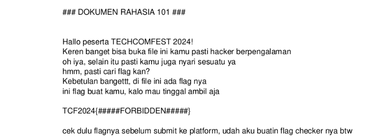
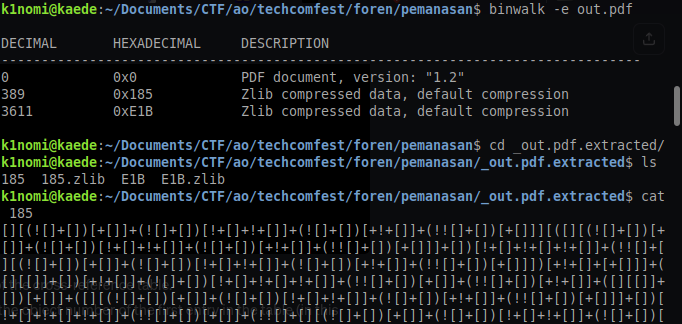
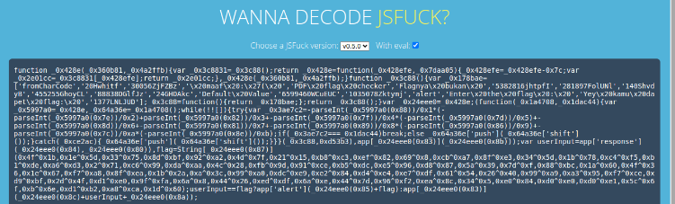
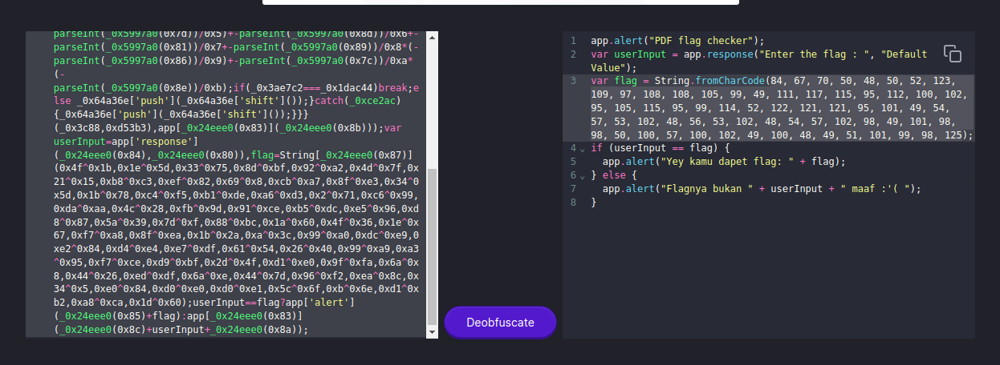
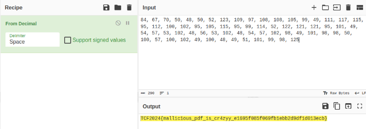

# pemanasan (139 pts)

### Deskripsi
> Author: fire
>
> I just create handmade pdf. Well i also made flag checker inside pdf file. Cool right? 😎

Pada soal ini kita diberikan sebuah pdf yang dikunci dengan password. Untuk nge-cracknya cukup straightforward, tinggal menggunakan command `pdfcrack --wordlist=rockyou.txt -f flag_protected.pdf`. Didapatkanlah passwordnya yakni “makanapel”.

Berikutnya, terdapat hint bahwa di dalam pdf ini terdapat flag checker (sebuah kode atau binary file). Tapi karena pada dasarnya file ini encrypted, jadi tidak bisa kita binwalk begitu saja lalu dapat isinya. Password protection pada pdf ini harus kita hilangkan terlebih dahulu. Untuk itu, saya menggunakan command `qpdf --password=makanapel --decrypt flag_protected.pdf out.pdf`.

Sekarang, kita bisa membuka out.pdf tanpa password, oleh karena itu langsung saja kita ekstrak menggunakan binwalk. Didapat 2 file zlib berikut. Yang pertama berisi kode `JSFuck`.

Langsung saja kita decode menjadi JS menggunakan https://enkhee-osiris.github.io/Decoder-JSFuck/ dan deobfuscate menggunakan https://obf-io.deobfuscate.io/. Hasilnya, kita menemukan flag yang di-encode menggunakan decimal.

Flag: `TCF2024{mallic1ous_pdf_is_cr4zyy_e1695f085f069fb1ebb2d9df1d013ecb}`