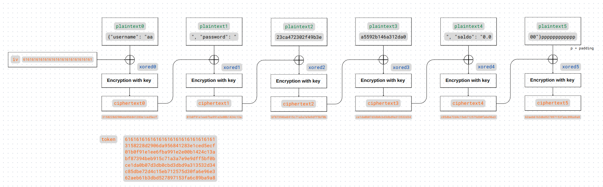
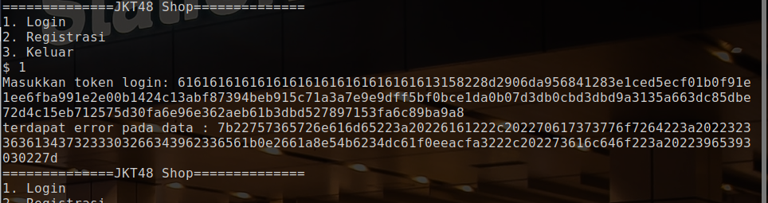
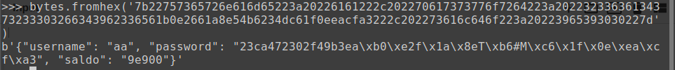
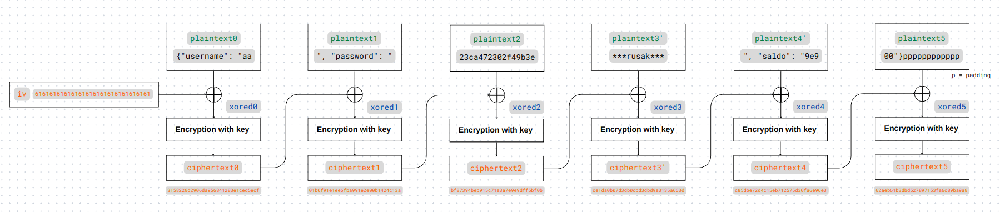
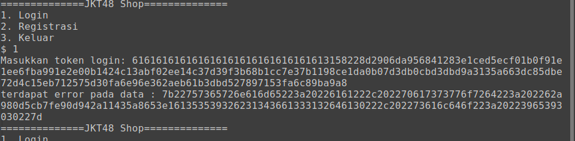
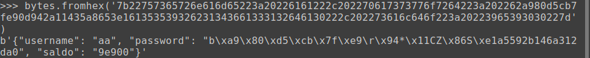
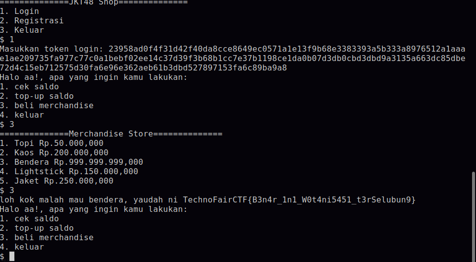

# Pengen Merch JKT 😢 (Solved after event)

### Deskripsi
> Pengen Merch JKT tapi gada duit :( top-up in dong bang.
>
> Author: AnYujin
>
> nc 103.152.242.197 54223

Solved after event. Saya akhirnya paham dengan soal ini setelah membaca [artikel ini](https://zhangzeyu2001.medium.com/attacking-cbc-mode-bit-flipping-7e0a1c185511) dan WU dari tim Moai (Terima kasih banyak abang2 🙏). Oh iya, karena solved after event, alias soal-nya cuma bisa saya jalanin secara lokal, kali ini saya buat key-nya random karena saya gatau key aslinya apa :v (spoiler: di soal ini, kita tidak perlu mencari tahu key-nya apa).

Baiklah, jadi, pada soal ini, kita diberikan service berisi sebuah program dan source code dari program tersebut.

##### server.py

```py
from secret import flag,KEY
import hashlib
import json
from Crypto.Cipher import AES
from Crypto.Util.Padding import pad,unpad
import binascii
import random

assert(len(KEY)==16)

barang_merchandise=[
	["Topi","Rp.50.000,000"],
	["Kaos" ,"Rp.200.000,000"],
	["Bendera" , "Rp.999.999.999,000"],
	["Lightstick","Rp.150.000,000"],
	["Jaket", "Rp.250.000,000"]
]

isi=[10000,20000,50000,100000]

def encrypt_data(data,iv):
	cipher=AES.new(KEY,AES.MODE_CBC,iv=binascii.unhexlify(iv))
	data=pad(data,16)
	token=cipher.encrypt(data)
	token=binascii.hexlify(token)
	return iv+token

def registrasi(username,password):
	iv=binascii.hexlify(password[:16].encode())
	hash_password=hashlib.md5(password.encode()).digest()
	hash_password=binascii.hexlify(hash_password).decode()
	data=json.dumps({"username":username,"password":hash_password,"saldo": "{:.3f}".format(0)}).encode()
	token=encrypt_data(data,iv)
	return token

def login(token):
	token=binascii.unhexlify(token)
	iv=token[:16]
	token=token[16:]
	cipher=AES.new(KEY,AES.MODE_CBC,iv=iv)
	data=cipher.decrypt(token)
	data=unpad(data,16)
	try:
		data=json.loads(data)
		return data,binascii.hexlify(iv)
	except:
		print(f"terdapat error pada data : {binascii.hexlify(data).decode()}")
		return "Error","Error"

def menu_toko(data,iv):
	while True:
		print(f"Halo {data['username']}!, apa yang ingin kamu lakukan: ")
		print("1. cek saldo")
		print("2. top-up saldo")
		print("3. beli merchandise")
		print("4. keluar")
		com=int(input("$ "))

		if(com==1):
			print(f"saldo kamu saat ini : {'{:.3f}'.format(float(data['saldo']))}")

		elif(com==2):
			unik=random.randint(0,999)
			print(f"pengen top-up berapa ni bwang")
			print("1. Rp.10.000")
			print("2. Rp.20.000")
			print("3. Rp.50.000")
			print("4. Rp.100.000")
			com=int(input("$ "))
			try:
				total=isi[com-1]+(unik/1000)
				total=str(total)
				print(total)
				total=total.replace('.',',')
				print(f"pembayaran ke gopay dengan nomor 0813-8377-5460")
				print(f"jumlah pembayaran : Rp.{total}")
				print(f"pastikan kamu menyertakan nominal dengan benar agar dapat kami proses")
			except:
				print("Transaksi top-up error")
		elif com==3:
			print("==============Merchandise Store==============")
			for idx,i in enumerate(barang_merchandise):
				print(f"{idx+1}. {i[0]} {i[1]}")
			com=int(input("$ "))
			try:
				harga=barang_merchandise[com-1][1].strip('Rp.')
				harga=harga.replace('.','')
				harga=harga.replace(',','.')
				harga=float(harga)
				if float(data["saldo"])<harga:
					print("Saldo anda kurang, silahkan melakukan top-up terlebih dahulu")
				else:
					data["saldo"]=str('{:.3f}'.format(float(data["saldo"])-harga))
					if(com!=3):
						print(f"{barang_merchandise[com-1][0]} anda akan segera dikirimkan :), terimakasih telah berbelanja")
					else:
						print(f"loh kok malah mau bendera, yaudah ni {flag}")
			except:
				print("input anda tidak valid!")
		elif com==4:
			print(f"terimakasih dan sampai jumpa!")
			print(f"token anda untuk sesi ini {encrypt_data(json.dumps(data).encode(),iv).decode()}")
			break
		else:
			print("input anda tidak valid!")

while True:
	print(f"==============JKT48 Shop==============")
	print(f"1. Login")
	print(f"2. Registrasi")
	print(f"3. Keluar")
	com=int(input("$ "))
	if(com==1):
		token=input("Masukkan token login: ")
		try:
			data,iv=login(token)
			if data=="Error":
				continue
		except:
			print("Token atau kode unik yang anda masukkan tidak valid!")
			continue
		menu_toko(data,iv)
	elif(com==2):
		username=input("Masukkan username: ")
		password=input("Masukkan password (minimal 16 karakter): ")
		if len(password)<16:
			print("password kurang dari 16 karakter, silahkan registrasi ulang")
		else:
			token=registrasi(username,password)
			print(f"gunakan token ini untuk login")
			print(f"token: {token.decode()}")
	elif com==3:
		print("Sayonara~~")
		exit()
	else:
		print("input anda tidak valid!")
```

Pada program, kita bisa melakukan registrasi, lalu meng-input username beserta password, lalu mendapatkan token yang dapat digunakan untuk login. 


Setelah mengotak-atik source code, saya menemukan bahwa token ini adalah data json dari user (berisi username, password, dan saldo) yang di-enkripsi menggunakan AES-CBC. Berikut adalah contoh json-nya.

`{"username": "aa", "password": "23ca472302f49b3ea5592b146a312da0", "saldo": "0.000"}`

Dengan data di atas, tokennya adalah sebagai berikut (dibagi ke dalam block): 

```
61616161616161616161616161616161
3158228d2906da956841283e1ced5ecf
01b0f91e1ee6fba991e2e00b1424c13a
bf87394beb915c71a3a7e9e9dff5bf0b
ce1da0b07d3db0cbd3dbd9a313532d34
c85dbe72d4c15eb712575d30fa6e96e3
62aeb61b3dbd527897153fa6c89ba9a8
```

Untuk mendapatkan flag, kita harus memanipulasi tokennya sedemikian sehingga data pada saldo berubah dari 0 menjadi angka yang sebesar mungkin. Karena enkripsi token menggunakan AES-CBC, kita dapat melakukan `Bit Flipping Attack`. Pertama-tama, konsep enkripsi AES dengan mode CBC adalah sebagai berikut.


Untuk penjelasan lengkap dan secara umum dapat dibaca pada [artikel](https://zhangzeyu2001.medium.com/attacking-cbc-mode-bit-flipping-7e0a1c185511) yang telah saya sebut di atas. Pada write-up ini, saya akan langsung membahas penerapannya pada soal. Apabila diagram di atas diterapkan pada token yang telah kita dapatkan, jadinya adalah seperti berikut.



Btw karena kita ingin decrypt, jadi bacanya dari kanan bawah ;). Nah, sekarang, kita mau manipulasi block `plaintext4` dari yang semula bytes di ujungnya bernilai `0.0` jadi angka yang besar, misalnya `9e9`. Saat ini, keadaannya adalah seperti berikut.

```
pt4 ^ ct3 = xor4

di mana:
pt  -> plaintext
ct  -> ciphertext
xor -> xored
```

Katakanlah `pt4` yang udah kita manipulasi nilai di ujung-nya jadi `9e9` itu disebut `pt4'`. Sekarang kita perlu mencari `ct3'` yang apabila di-xor dengan `xor4`, hasilnya akan jadi `9e9` (atau `pt4'`, sama aja). Pertama-tama kita cari tahu dulu nilai dari `xor4`, lalu kita xor-kan `xor4` tersebut dengan nilai yang diinginkan, yakni `9e9`, hasilnya adalah `ct3'`. Dengan me-replace `ct3` pada token dengan `ct3'`, kita akan mendapatkan nilai saldo yang kita inginkan karena `ct3' ^ xor4 = pt4'` :).

Note: nilai `ct3`, `pt4`, dan `pt4'` sudah diketahui (`ct3` ada di token, `pt4` adalah pada data json, dan `pt4'` adalah nilai data yang kita inginkan (`9e9`)).

```
xor4 = ct3 ^ pt4
ct3' = xor4 ^ 9e9 (sama saja dengan xor4 ^ pt4')

dengan begitu, ct3' = ct3 ^ pt4 ^ pt4'
```

Adapun dalam kode, bentukannya adalah seperti berikut.

```py
import binascii
from pwn import *

# pecah token menjadi ke dalam blocks (block ct/ciphertext)
token = "616161616161616161616161616161613158228d2906da956841283e1ced5ecf01b0f91e1ee6fba991e2e00b1424c13abf87394beb915c71a3a7e9e9dff5bf0bce1da0b07d3db0cbd3dbd9a313532d34c85dbe72d4c15eb712575d30fa6e96e362aeb61b3dbd527897153fa6c89ba9a8"
token = bytearray(binascii.unhexlify(token))
ct = [token[i:i+16] for i in range(0, len(token), 16)]

# untuk ct3, lakukan bit flipping
# note: kenapa index block ciphertextnya 4 dan bukan 3, karena kalau di token, block ke-0 nya itu IV
ct[4][-3] = ct[4][-3] ^ ord("0") ^ ord("9")
ct[4][-2] = ct[4][-2] ^ ord(".") ^ ord("e")
ct[4][-1] = ct[4][-1] ^ ord("0") ^ ord("9")

# print hasil token baru, submit ke server
for cipherblock in ct:
	print(binascii.hexlify(cipherblock).decode(), end="")

print()
```

Hasil token (per block):

```
61616161616161616161616161616161
3158228d2906da956841283e1ced5ecf
01b0f91e1ee6fba991e2e00b1424c13a
bf87394beb915c71a3a7e9e9dff5bf0b
ce1da0b07d3db0cbd3dbd9a3135a663d	--> updated
c85dbe72d4c15eb712575d30fa6e96e3
62aeb61b3dbd527897153fa6c89ba9a8
```

Sekarang, kita bisa masukkan token baru ini ke server, dan...



...tidak bisa. Masalahnya adalah, ketika kita memasukkan token untuk login, server akan melakukan dekripsi dan memeriksa terlebih dahulu apakah hasil dekripsinya merupakan json yang valid (silakan lihat kode `server.py` di atas pada definisi fungsi `login()`).

Server memberitahukan pada kita "terdapat error pada data" dan memberikan string hex yang bisa di-decode.



Di sini, terlihat bahwa block yang mengandung saldo telah berhasil kita manipulasi nilainya. Tetapi, block sebelumnya malah jadi rusak. Ini karena ciphertext dari block tersebut baru saja kita ganti.

Untuk memperbaiki hal tersebut, caranya sebenarnya mirip dengan sebelumnya. Kita manipulasi saja lagi block ciphertext sebelumnya supaya block plaintext yang rusak kembali seperti semula. Untuk itu, kita bisa kembali merujuk ke diagram ini. 



```
misalkan pt3' --> plaintext yang rusak

xor3 = ct2 ^ pt3'
ct2' = xor3 ^ pt3

dengan begitu, ct2' = ct2 ^ pt3' ^ pt3
```

Adapun dalam kode, bentukannya adalah seperti berikut. Oh iya, kali ini, yang dimanipulasi adalah keseluruhan block, bukan hanya beberapa bytes. Untuk itu, kita bisa gunakan fungsi `xor()` dari `pwntools`.

```py
# plaintext (per block)
pt0 = '{"username": "aa'
pt1 = '", "password": "'
pt2 = '23ca472302f49b3e'
pt3 = 'a5592b146a312da0'
pt4 = '", "saldo": "0.0'
pt5 = '00"}'

# untuk ct2, lakukan bit flipping
# note: lagi2 kenapa ct[3] dan bukan ct[2], itu karena index pertama dipake sama iv
newpt = '7b22757365726e616d65223a20226161222c202270617373776f7264223a20223233636134373233303266343962336561b0e2661a8e54b6234dc61f0eeacfa3222c202273616c646f223a20223965393030227d'
newpt = bytearray(binascii.unhexlify(newpt))
newpt = [newpt[i:i+16] for i in range(0, len(newpt), 16)]

ct[3] = xor(xor(ct[3], newpt[3]), pt3)

# print hasil token baru, submit ke server
for cipherblock in ct:
	print(binascii.hexlify(cipherblock).decode(), end="")

print()
```

Hasil token (per block):

```
61616161616161616161616161616161
3158228d2906da956841283e1ced5ecf
01b0f91e1ee6fba991e2e00b1424c13a
bf02ee14c37d39f3b68b1cc7e37b1198	--> updated
ce1da0b07d3db0cbd3dbd9a3135a663d	--> updated
c85dbe72d4c15eb712575d30fa6e96e3
62aeb61b3dbd527897153fa6c89ba9a8
```

Sekarang, apabila kita memasukkan token tersebut ke server untuk login...




Masih error. Kali ini, block sebelumnya lagi-lah yang rusak. Dan sebenarnya, kita memang harus melakukan ini terus menerus sampai block paling awal. Caranya sama persis dengan yang sudah dibahas sebelumnya. Manipulasi ciphertext pada token, submit ke server, dapatkan plaintext barunya, buat token baru lagi, begitu seterusnya. Berikut ini adalah kodenya (btw, untuk kode solver lengkapnya, silakan cek file `solve.py`).

```py
# untuk ct1
newpt = '7b22757365726e616d65223a20226161222c202270617373776f7264223a202262a980d5cb7fe90d942a11435a8653e161353539326231343661333132646130222c202273616c646f223a20223965393030227d'
newpt = bytearray(binascii.unhexlify(newpt))
newpt = [newpt[i:i+16] for i in range(0, len(newpt), 16)]

ct[2] = xor(xor(ct[2], newpt[2]), pt2)

# print hasil token baru, submit ke server
for cipherblock in ct:
	print(binascii.hexlify(cipherblock).decode(), end="")

print()

# untuk ct0
newpt = '7b22757365726e616d65223a20226161446e1cbca0d127d59c1760010dedf79b3233636134373233303266343962336561353539326231343661333132646130222c202273616c646f223a20223965393030227d'
newpt = bytearray(binascii.unhexlify(newpt))
newpt = [newpt[i:i+16] for i in range(0, len(newpt), 16)]

ct[1] = xor(xor(ct[1], newpt[1]), pt1)

# print hasil token baru, submit ke server
for cipherblock in ct:
	print(binascii.hexlify(cipherblock).decode(), end="")

print()

# untuk iv
newpt = '39d69ec2f0e01242f809eb97a9279ec0222c202270617373776f7264223a20223233636134373233303266343962336561353539326231343661333132646130222c202273616c646f223a20223965393030227d'
newpt = bytearray(binascii.unhexlify(newpt))
newpt = [newpt[i:i+16] for i in range(0, len(newpt), 16)]

ct[0] = xor(xor(ct[0], newpt[0]), pt0)

# print hasil token baru, submit ke server
for cipherblock in ct:
	print(binascii.hexlify(cipherblock).decode(), end="")

print()

# Token akhir: 23958ad0f4f31d42f40da8cce8649ec0571a1e13f9b68e3383393a5b333a8976512a1aaae1ae209735fa977c77c0a1bebf02ee14c37d39f3b68b1cc7e37b1198ce1da0b07d3db0cbd3dbd9a3135a663dc85dbe72d4c15eb712575d30fa6e96e362aeb61b3dbd527897153fa6c89ba9a8
```

Note: waktu soal ini masih up dan servernya masih jalan, kita bisa mengotomatisasi pengambilan `newpt` dari server dengan menggunakan `pwntools`. Dengan begitu, prosesnya bisa kita buat menjadi loop dan solvernya tidak perlu sepanjang ini :v. Anyways, berikut hasil token akhir (per block):

```
23958ad0f4f31d42f40da8cce8649ec0	--> updated
571a1e13f9b68e3383393a5b333a8976	--> updated
512a1aaae1ae209735fa977c77c0a1be	--> updated
bf02ee14c37d39f3b68b1cc7e37b1198	--> updated
ce1da0b07d3db0cbd3dbd9a3135a663d	--> updated
c85dbe72d4c15eb712575d30fa6e96e3
62aeb61b3dbd527897153fa6c89ba9a8
```

Kali ini, proses login berhasil. Flag pun didapatkan :D.




Flag: `TechnoFairCTF{B3n4r_1n1_W0t4ni5451_t3rSelubun9}`