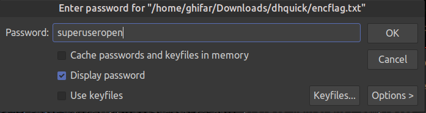
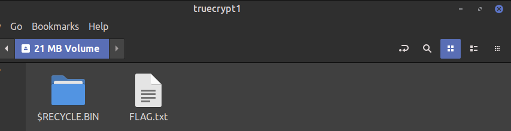
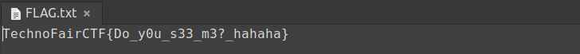

# bantu aku mencari sebuah rahasia (Solved after event)

### Deskripsi
> Namaku Aseng, Aku sedang menulis sebuah file rahasia, namun dengan tiba-tiba hacker yang bernama Kori telah masuk ke system komputerku, tetapi aku berhasil menyelamatkan file ku, namun sekarang aku bingung dimana file dan kuncinya itu berada. Bisakah kamu membantu aku? :(
>
> Link Soal: Chall
>
> Author: X-Mark

Pada chall ini kita diberikan sebuah dump memory yaitu `findmebro.raw`. Untuk file memory dump, kita bisa menggunakan tool `Volatility`. Di sini, saya menggunakan `Volatility2`.

Dalam menggunakan `Volatility`, ada beberapa command/plugin yang dapat kita gunakan. Di antaranya adalah sebagai berikut (Ini adalah cheatsheet saya :p).

```
# Cek tipe/profil dari file dump
$ vol.py -f MyDump.dmp imageinfo

# Cek proses
$ vol.py -f MyDump.dmp --profile=MyProfile pslist
$ vol.py -f MyDump.dmp --profile=MyProfile pstree
$ vol.py -f MyDump.dmp --profile=MyProfile psxview

# Cek koneksi TCP/UDP yang terbuka
$ vol.py -f MyDump.dmp --profile=MyProfile connscan
$ vol.py -f MyDump.dmp --profile=MyProfile sockets
$ vol.py -f MyDump.dmp --profile=MyProfile netscan

# Cek history command line
$ vol.py -f MyDump.dmp --profile=MyProfile cmdline
$ vol.py -f MyDump.dmp --profile=MyProfile consoles
$ vol.py -f MyDump.dmp --profile=MyProfile cmdscan

# Ekstrak executable/bagian dari memory
$ vol.py -f MyDump.dmp --profile=MyProfile procdump -p MyPid --dump-dir .
$ vol.py -f MyDump.dmp --profile=MyProfile memdump -p MyPid --dump-dir .

# Cek file yang ada
$ vol.py -f MyDump.dmp --profile=MyProfile filescan

# Ekstrak file
$ vol.py -f MyDump.dmp --profile=MyProfile dumpfiles -Q 0xMemoryOffset --name file -D . --unsafe
```

Oke langsung saja kita kerjakan. Pertama-tama, kita cek dulu profile yang dump memory yang sedang kita analisis.

```
$ vol.py -f findmebro.raw imageinfo
Volatility Foundation Volatility Framework 2.6.1
INFO    : volatility.debug    : Determining profile based on KDBG search...
          Suggested Profile(s) : Win7SP1x64, Win7SP0x64, Win2008R2SP0x64, Win2008R2SP1x64_24000, Win2008R2SP1x64_23418, Win2008R2SP1x64, 
...
...
...
```

Didapat profile nya adalah `Win7SP1x64`. Oleh karena itu kita lanjut ke tahap berikutnya. Kita coba cek proses yang berjalan pada memory dengan `pstree`

```
$ vol.py -f findmebro.raw --profile=Win7SP1x64 pstree
Volatility Foundation Volatility Framework 2.6.1
Name                                                  Pid   PPid   Thds   Hnds Time
-------------------------------------------------- ------ ------ ------ ------ ----
 0xfffffa80038c2950:csrss.exe                         332    324      8    350 2023-07-14 07:26:05 UTC+0000
 0xfffffa80018b4060:wininit.exe                       380    324      3     74 2023-07-14 07:26:05 UTC+0000
. 0xfffffa80038b0b30:services.exe          
...
...
...
 0xfffffa8003d3ab30:explorer.exe                     1412   1344     36   1028 2023-07-14 07:26:07 UTC+0000
. 0xfffffa8003fd1290:cmd.exe                         2012   1412      1     19 2023-07-14 07:26:18 UTC+0000
. 0xfffffa8001b77060:DumpIt.exe                      2996   1412      2     45 2023-07-14 07:39:59 UTC+0000
. 0xfffffa800291b9a0:TrueCrypt.exe                    192   1412      5    266 2023-07-14 07:27:14 UTC+0000
 0xfffffa8003acda40:GoogleCrashHan                   1116   1960      5     83 2023-07-14 07:26:10 UTC+0000
 0xfffffa8003a3fb30:GoogleCrashHan
```

Di sini ada yang menarik yakni `TrueCrypt`. Saya mengasumsikan bahwa TrueCrypt itu merupakan software tersendiri, bukan proses dari sistem bawaan windows. Rupanya benar, TrueCrypt adalah software yang berfungsi untuk mengenkripsi file. Bagaimanapun, terdapat clue pada soal yang mengarahkan pada "file". Oleh karena itu, berikutnya akan kita lakukan `filescan`. Karena hasilnya sangat banyak, saya limit untuk file berekstensi `.txt` saja (andaikan tidak ketemu, bisa dicoba dengan file extension lain).

```
$ vol.py -f findmebro.raw --profile=Win7SP1x64 filescan | grep -Fi .txt
Volatility Foundation Volatility Framework 2.6.1
0x000000007d994a80      1      1 -W-rw- \Device\HarddiskVolume1\Users\Challaul\AppData\Local\Temp\FXSAPIDebugLogFile.txt
0x000000007dfb25d0     18      1 RW-r-- \Device\HarddiskVolume1\Windows\Tasks\SCHEDLGU.TXT
0x000000007e8319b0     16      0 RW-r-- \Device\HarddiskVolume1\Users\Challaul\Downloads\password. txt.txt
0x000000007f22add0      7      0 R--rwd \Device\HarddiskVolume1\Users\Challaul\Downloads\encryptedflag.txt
```

Di sini ada dua file yang menarik, yakni `password.txt` dan `encryptedflag.txt`. Langsung saja kita ekstrak menggunakan `dumpfiles`.

```
$ vol.py -f findmebro.raw --profile=Win7SP1x64 dumpfiles -Q 0x000000007e8319b0 --name file -D . --unsafe
Volatility Foundation Volatility Framework 2.6.1
DataSectionObject 0x7e8319b0   None   \Device\HarddiskVolume1\Users\Challaul\Downloads\password. txt.txt

$ vol.py -f findmebro.raw --profile=Win7SP1x64 dumpfiles -Q 0x000000007f22add0 --name file -D . --unsafe
Volatility Foundation Volatility Framework 2.6.1
DataSectionObject 0x7f22add0   None   \Device\HarddiskVolume1\Users\Challaul\Downloads\encryptedflag.txt
```

Kalau file `encryptedflag.txt` dibaca, hasilnya adalah tidak jelas karena sudah terenkripsi. Sementara itu, kalau `password.txt` dibaca, hasilnya adalah sebagai berikut.

```
password : superuseropen

aku pakai tools enkripsi benar agar file ku aman
```

Kita diberikan password dekripsi flag-nya. Selain itu, ada keterangan bahwa flag dienkripsi mengginakan sebuah "tool enkripsi". Kemungkinan besar, tool yang dimaksud adalah `TrueCrypt`, yang sebelumnya telah kita temukan pada daftar proses.

Untuk mendekripsi `encryptedflag.txt`, saya meng-install `TrueCrypt` dan memasukkan file serta password yang diberikan.

```
$ truecrypt encflag.txt 
```




Pada akhirnya, flag pun didapatkan.



Flag: `TechnoFairCTF{Do_y0u_s33_m3?_hahaha}`