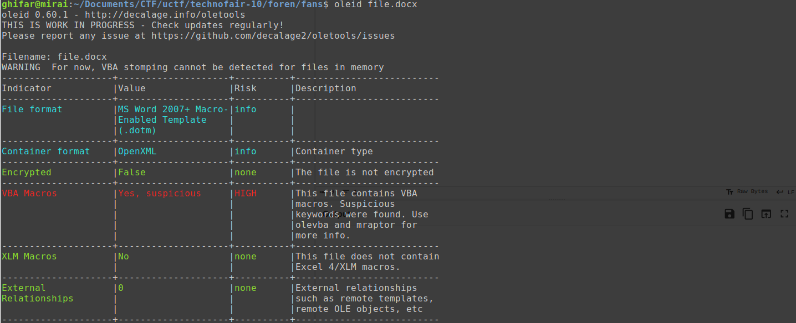
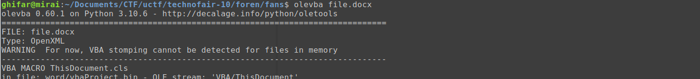
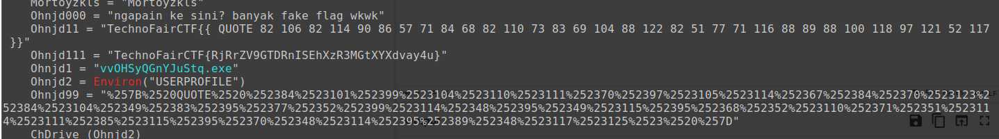
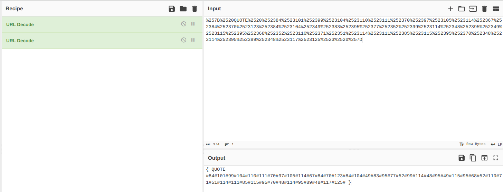
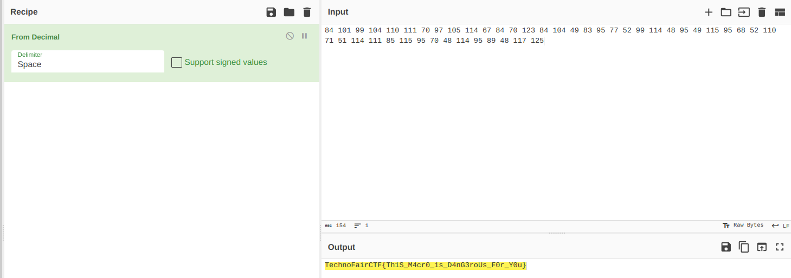

# file pemberian fans (Solved after event)

### Deskripsi
> aldi taher di kirimkan penggemar suatu file melalui gmail, ketika file tersebut di buka beliau mendapatkan notif windows firewall yang mendeteksi adanya virus, dia shock dan dia ingin meminta bantuan apakah anda siap membantu beliau untuk mengecek isi file tersebut?
>
> Author : MuhammadR 
>
> https://mega.nz/file/9WkQTJDD#NPKkNvQJe06k86fqMHO4y9NxDxqDPALHvrl78_eCApI

Pada soal ini, kita diberikan file `file.docx` yang apabila kita coba download dari link Mega di atas, akan ada semacam peringatan. Hmm, mungkin malware? Karena saya tidak tahu, saya mencoba mencari dengan kata kunci `"ctf docx malware"`. Hasil2nya mengarahkan pada "macro" dan sebuah tool untuk membaca macro pada file" dokumen microsoft (OLE), yaitu `oletools`. 

Jadi, `oletools` ini terdiri dari beberapa tool yang lebih spesifik. Misalnya, untuk menganalisis `file.docx` tadi terlebih dahulu, kita bisa menggunakan `oleid`.

Hmm, terlihat bahwa ada yang sus pada VBA dari file. Untuk menganalisis VBA, kita bisa menggunakan `olevba`.

Nah, di sini ada banyak hal, apabila kita scroll bawah dikit, ada yang menarik.

String yang terlihat seperti desimal dan base64 itu setelah ditelusuri ternyata merupakan fake flag. Tapi apabila kita decode string yang terlihat seperti format url...

...lalu ambil nilai desimalnya saja...

...flag pun didapatkan :D.

Flag: `TechnoFairCTF{Th1S_M4cr0_1s_D4nG3roUs_F0r_Y0u}`