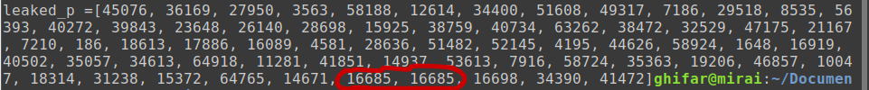

# Sekte Pemuja Osha Oshi

### Deskripsi

> Harukaze pipit berhasil menangkap pesan rahasia dari sebuah sekte rahasia, ia juga mendapatkan bocoran yang dapat membantunya.
>
> Author: AnYujin

Kita diberikan source code beserta outputnya.

**chall.py**

```py
from Crypto.Util.number import *
from sage.all import *
import random

def encrypt(p):
	p=bin(p)[2:]
	p='0'*(len(p)%64)+p
	p=[int(p[i:i+16],2) for i in range(0,len(p),16)]
	key=random.getrandbits(16)
	p=[i^key for i in p]
	return p

flag=b'REDACTED'
p=getPrime(1024)
q=getPrime(1024)
e=0x10001
n=p*q

temp = p & ((1<<37)-1)
p >>= 81
p <<= 81
p += temp
p = encrypt(p)

flag=bytes_to_long(flag)
enc=pow(flag,e,n)
print(f'enc : {enc}')
print(f'n : {n}')
print(f'e : {e}')
print(f'leaked_p :{p}')
```

**out**

```
enc = 29004754752602891845701088578222561842513874918199800431567395933687795651470110377063745715224303592560274634075790412592313062222984678812372502446455553874025887805048706501835504141010199497560376154063288969798733730977056261626071788261554096303337042690996275614463889111101331868052859671922570628337639260391486134758084403718297925958046876883450312203509912864798807966117003174457393430905875449096266440351779141369905085213013783089319684239294684146737340793537160633379849038762741682795276911283424980467314859075820283929128473248792350786471543057922435616411342493331051424182347254472208007118691
n = 29353585191166156442189968012744774060523695365304588409452746298446966090446842013875144703842901644120084459742264199601712574341648935494662522676662195240580196375882847987434122422257670543787177894139225539012913211123707515022561081594248680970805167931112717636527712860774929806451263605673800306509371173663128670975257217464868471515902953618301217178231352288283127976806763613672091333537163342358371199303987661809368689697952949595308131881547519088258353529773216590952608452869230534334146785053625093426887703186355237207342461913924093535411997384080910520555094397726389504592515273009631000424191
e = 65537
leaked_p =[45076, 36169, 27950, 3563, 58188, 12614, 34400, 51608, 49317, 7186, 29518, 8535, 56393, 40272, 39843, 23648, 26140, 28698, 15925, 38759, 40734, 63262, 38472, 32529, 47175, 21167, 7210, 186, 18613, 17886, 16089, 4581, 28636, 51482, 52145, 4195, 44626, 58924, 1648, 16919, 40502, 35057, 34613, 64918, 11281, 41851, 14937, 53613, 7916, 58724, 35363, 19206, 46857, 10047, 18314, 31238, 15372, 64765, 14671, 16685, 16685, 16698, 34390, 41472]
```

Jadi, intinya adalah sebagai berikut:

* `p` terdiri dari `1024` digit dalam binary
* `81` digit terakhir dari `p` dihapus dengan bitwise shift
* tapi, `37` digit terakhirnya di-preserve/tetap ada
* jadi, sekarang di tengah ada (81-37 = `44`) digit yang berupa "0000..."
* pembagiannya kira2 seperti berikut
  * `[943][44][37]`
  * yang depan **diketahui**, yang tengah **tidak diketahui**, yang belakang **diketahui**

Kita bisa me-recover nilai `p` dengan me-reverse fungsi `encrypt()` dan memasukkan nilai `leaked_p`. Tapi, andaikan sudah kita balik pun, nilai `p` tersebut bukanlah nilai `p` asli, melainkan nilai `p` yang 44 digit-nya hilang. Oleh karena itu, tugas kita adalah me-recover `p` asli dari `p` yang nilai bit-nya hilang tersebut.

Sebelum itu, kita cari tahu dulu nilai `p` yang nilai bit-nya hilang (setelahnya akan saya sebut sebagai `p_new`) dengan membalikkan fungsi `encrypt()`. Apabila kita membaca cara kerja fungsinya, tampak bahwa key-nya di-random lalu di-xor-kan dengan chunk2 dari nilai `p_new` yang masing2 terdiri dari 16-bit. Mengingat ada 44 digit dari nilai `p_new` yang berupa "0000...", maka setidaknya ada 2 chunk yang hasil pada `leaked_p`-nya merupakan key nya itu sendiri. Dan benar saya, di `leaked_p`, kita menemukan dua chunk beruntun yang memiliki nilai sama. Kemungkinan besar ini adalah key-nya.



Berikut adalah kode untuk mendapatkan nilai `p_new`.

```py
```

Nah sekarang, kita akan me-recover nilai `p` asli dari `p_new`.
