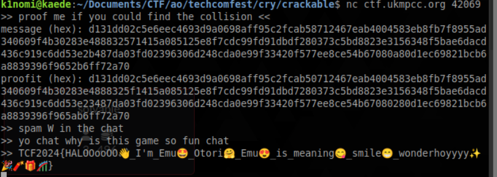

# crackable

### Deskripsi

> Author: rui
>
> did you know that md5 is not supposed to be used? yep cause it's crackable
>
> nc ctf.ukmpcc.org 42069

Kita diberikan source code dari server. Intinya server akan meminta dua buah string (hex) yang hasil MD5 nya sama sehingga membuktikan adanya collision pada MD5.

```py
from Crypto.Util.number import *

flag = "YOKOSO_KIRAKIRA_DOKIDOKI_MOCHIMOCHI_PUYOPUYO_WAKUWAKU_WASHOI"
N = 0x11b4c225f4dc385553faef71fd12d7a7d3731eebb47d01df2bd9c06cc95d67d933a3867dc3ef17547ae5a969dbc985489a3e835ddb0f8e1eb82b2cb84a5b168f74a808a0b7accbc1513cd416a5e8a4055a2823e192bdbe5da3583b11b0a1697a5a47

def able(s):
    a = inverse(e, N)
    b = pow(a, 2, N)
    return (pow(e, s, N) + pow(a, s, N) + pow(b, s, N)) % N

def solv(nbit):
    pbit = nbit // 3
    p, q, r = [getPrime(pbit) for _ in range(3)]
    return p*q*r, able((q * r) % (1 << pbit))

m = bytes_to_long(flag.encode())
e = 65537
n, u = solv(1536)
c = pow(m, e, n)

print(f"{n = }\n{u = }\n{c = }")
```

Contoh collision MD5 paling sederhana ada di https://www.mscs.dal.ca/\~selinger/md5collision/. Berikutnya tinggal submit saja ke server dan flag didapatkan.



Flag: `TCF2024{HALOOooOO👋_I'm_Emu🤩_Otori🤗_Emu😍_is_meaning😋_smile😁_wonderhoyyyy✨🎉🧨🎁🎢}`
